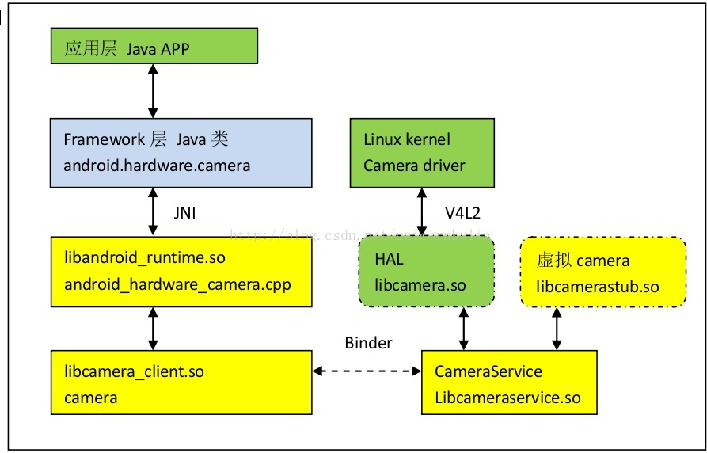
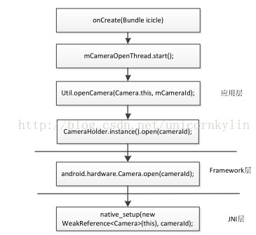

# 
Android Camera运行流程

-----------------------------------------------------------------------------------
 

## 1.1 总体架构

Android Camera 框架从整体上看是一个 client/service 的架构,有两个进程:
 
1.client 进程,可以看成是 AP 端,主要包括 JAVA 代码与一些 native c/c++代码;
 
2.service 进 程,属于服务端,是 native c/c++代码,主要负责和 linux kernel 中的 camera driver 交互,搜集 linux kernel 中 camera driver传上来的数据,并交给显示系统显示。
 
3.client 进程与 service 进程通过 Binder 机制通信, client 端通过调用 service 端的接口实现各个具体的功能。

## 1.2 CameraService服务

### 1.2.1 CameraService服务的注册
**file path**：frameworks/av/camera/cameraserver/main_cameraserver.cpp

	/*
	 * Copyright (C) 2015 The Android Open Source Project
	 *
	 * Licensed under the Apache License, Version 2.0 (the "License");
	 * you may not use this file except in compliance with the License.
	 * You may obtain a copy of the License at
	 *
	 *      http://www.apache.org/licenses/LICENSE-2.0
	 *
	 * Unless required by applicable law or agreed to in writing, software
	 * distributed under the License is distributed on an "AS IS" BASIS,
	 * WITHOUT WARRANTIES OR CONDITIONS OF ANY KIND, either express or implied.
	 * See the License for the specific language governing permissions and
	 * limitations under the License.
	 */
	
	#define LOG_TAG "cameraserver"
	//#define LOG_NDEBUG 0
	
	#include "CameraService.h"
	#include <hidl/HidlTransportSupport.h>
	
	using namespace android;
	
	int main(int argc __unused, char** argv __unused)
	{
	    signal(SIGPIPE, SIG_IGN);
	
	    // Set 3 threads for HIDL calls
	    hardware::configureRpcThreadpool(3, /*willjoin*/ false);
	
	    sp<ProcessState> proc(ProcessState::self());
	    sp<IServiceManager> sm = defaultServiceManager();
	    ALOGI("ServiceManager: %p", sm.get());
	    CameraService::instantiate();
	    ProcessState::self()->startThreadPool();
	    IPCThreadState::self()->joinThreadPool();
	}

### 1.2.2 其中CameraService::instantiate();方法调用
**file path**：frameworks/av/services/camera/libcameraservice/CameraService.h

	class CameraService :
	    public BinderService<CameraService>,
	    public virtual ::android::hardware::BnCameraService,
	    public virtual IBinder::DeathRecipient,
	    public camera_module_callbacks_t,
	    public virtual CameraProviderManager::StatusListener
	{
	    friend class BinderService<CameraService>;
	    friend class CameraClient;
	public:
	    class Client;
	    class BasicClient;
	
	    // The effective API level.  The Camera2 API running in LEGACY mode counts as API_1.
	    enum apiLevel {
	        API_1 = 1,
	        API_2 = 2
	    };
	...
	......
	.........
	}

**key note:**从以上定义可以看出CameraService 继承于BinderService,所以CameraService::instantiate(); 其实是调用BinderService中的instantiate。

### 1.2.3 BinderService定义
**file path**：frameworks/native/libs/binder/include/binder/BinderService.h

	// ---------------------------------------------------------------------------
	namespace android {
	
	template<typename SERVICE>
	class BinderService
	{
	public:
	    static status_t publish(bool allowIsolated = false) {
	        sp<IServiceManager> sm(defaultServiceManager());
	        return sm->addService(
	                String16(SERVICE::getServiceName()),
	                new SERVICE(), allowIsolated);
	    }
	
	    static void publishAndJoinThreadPool(bool allowIsolated = false) {
	        publish(allowIsolated);
	        joinThreadPool();
	    }
	
	    static void instantiate() { publish(); }
	
	    static status_t shutdown() { return NO_ERROR; }
	
	private:
	    static void joinThreadPool() {
	        sp<ProcessState> ps(ProcessState::self());
	        ps->startThreadPool();
	        ps->giveThreadPoolName();
	        IPCThreadState::self()->joinThreadPool();
	    }
	};
	
	
	}; // namespace android
	// ---------------------------------------------------------------------------

**key note:**
 
1.可以发现在publish(）函数中，CameraService完成服务的注册 。这里面有个SERVICE，源码中有说明。
  
2.template&lt;typename SERVICE>
这表示SERVICE是个模板，这里是注册CameraService，所以可以用CameraService代替。
 
3.return sm->addService(String16(CameraService::getServiceName()), new CameraService());
这样，Camera就在ServiceManager完成服务注册，提供给client随时使用。
 
4.main_cameraserver主函数由init.rc在启动是调用，所以在设备开机的时候Camera就会注册一个服务，用作binder通信。

## 1.3 client端的应用层到JNI层（Camera App ---> JNI）

### 1.3.1 调用流程

**key note:**从第1.2节的分析中可知，Binder服务已注册，那接下来就看看client如何连上server端，并打开camera模块。先从camera app的源码入手。在onCreate()函数中专门有一个open Camera的线程。

### 1.3.2 应用层(camera app)
**file path**：packages/apps/LegacyCamera/src/com/android/camera/Camera.java

	@Override
    public void onCreate(Bundle icicle) {
        super.onCreate(icicle);
        getPreferredCameraId();
        String[] defaultFocusModes = getResources().getStringArray(
                R.array.pref_camera_focusmode_default_array);
        mFocusManager = new FocusManager(mPreferences, defaultFocusModes);

        /*
         * To reduce startup time, we start the camera open and preview threads.
         * We make sure the preview is started at the end of onCreate.
         */
        mCameraOpenThread.start();

          ................
        mCameraPreviewThread = null;
    }

再看看mCameraOpenThread

	Thread mCameraOpenThread = new Thread(new Runnable() {
        public void run() {
            try {
                mCameraDevice = Util.openCamera(Camera.this, mCameraId);
            } catch (CameraHardwareException e) {
                mOpenCameraFail = true;
            } catch (CameraDisabledException e) {
                mCameraDisabled = true;
            }
        }
    });

继续追Util.openCamera ,Util类的定义： 
**file path**：packages/apps/LegacyCamera/src/com/android/camera/Util.java

	public static android.hardware.Camera openCamera(Activity activity, int cameraId)
            throws CameraHardwareException, CameraDisabledException {
        // Check if device policy has disabled the camera.
        ...............
        try {
            return CameraHolder.instance().open(cameraId);
        } catch (CameraHardwareException e) {
            // In eng build, we throw the exception so that test tool
            // can detect it and report it
            if ("eng".equals(Build.TYPE)) {
                throw new RuntimeException("openCamera failed", e);
            } else {
                throw e;
            }
        }
    }

又来了个CameraHolder，该类用一个实例open Camera
 
CameraHolder的定义如下： 
**file path**：packages/apps/LegacyCamera/src/com/android/camera/CameraHolder.java

    public synchronized android.hardware.Camera open(int cameraId)
            throws CameraHardwareException {
       ..............
        if (mCameraDevice == null) {
            try {
                Log.v(TAG, "open camera " + cameraId);
                mCameraDevice = android.hardware.Camera.open(cameraId);//进入framework层
                mCameraId = cameraId;
            } catch (RuntimeException e) {
                Log.e(TAG, "fail to connect Camera", e);
                throw new CameraHardwareException(e);
            }
            mParameters = mCameraDevice.getParameters();
        } else {
            ............
        }
        ++mUsers;
        mHandler.removeMessages(RELEASE_CAMERA);
        mKeepBeforeTime = 0;
        return mCameraDevice;
    }

**key note:**其中调用frameworks/base/core/java/android/hardware/Camera.java类的open方法 ，进入Framework层。

### 1.3.3 Framework层
其中Framework层的open函数定义如下：
 
**file path**：frameworks/base/core/java/android/hardware/Camera.java

	public static Camera open(int cameraId) {
        return new Camera(cameraId);
    }

其中调用了Camera的构造函数：

	/** used by Camera#open, Camera#open(int) */
    Camera(int cameraId) {
        if(cameraId >= getNumberOfCameras()){
             throw new RuntimeException("Unknown camera ID");
        }
        int err = cameraInitNormal(cameraId);
        if (checkInitErrors(err)) {
            if (err == -EACCES) {
                throw new RuntimeException("Fail to connect to camera service");
            } else if (err == -ENODEV) {
                throw new RuntimeException("Camera initialization failed");
            }
            // Should never hit this.
            throw new RuntimeException("Unknown camera error");
        }
    }

这里调用cameraInitNormal：

	private int cameraInitNormal(int cameraId) {
        return cameraInitVersion(cameraId, CAMERA_HAL_API_VERSION_NORMAL_CONNECT);
    }

这里调用cameraInitVersion：

    private int cameraInitVersion(int cameraId, int halVersion) {
        mShutterCallback = null;
        mRawImageCallback = null;
        mJpegCallback = null;
        mPreviewCallback = null;
        mPostviewCallback = null;
        mUsingPreviewAllocation = false;
        mZoomListener = null;
        /* ### QC ADD-ONS: START */
        mCameraDataCallback = null;
        mCameraMetaDataCallback = null;
        /* ### QC ADD-ONS: END */

        Looper looper;
        if ((looper = Looper.myLooper()) != null) {
            mEventHandler = new EventHandler(this, looper);
        } else if ((looper = Looper.getMainLooper()) != null) {
            mEventHandler = new EventHandler(this, looper);
        } else {
            mEventHandler = null;
        }

        String packageName = ActivityThread.currentOpPackageName();

        //Force HAL1 if the package name falls in this bucket
        String packageList = SystemProperties.get("camera.hal1.packagelist", "");
        if (packageList.length() > 0) {
            TextUtils.StringSplitter splitter = new TextUtils.SimpleStringSplitter(',');
            splitter.setString(packageList);
            for (String str : splitter) {
                if (packageName.equals(str)) {
                    halVersion = CAMERA_HAL_API_VERSION_1_0;
                    break;
                }
            }
        }
        return native_setup(new WeakReference<Camera>(this), cameraId, halVersion, packageName); //调用JNI
    }

**key note:**从这里开始通过JNI调用到native_setup( )，这里在系统上电时已经把JNI的一个对象注册成类Camer的Listener。

### 1.3.4 JNI层
native&#95;setup( )接口在libandroid&#95;runtime.so中实现，由Framework层通过JNI调用该接口。该接口主要是实现如下两个功能：
 
1、实现Camera C/S架构的客户端和服务端的连接（通过调用connect方法，进入libcamera&#95;client.so）。
 
2、set一个监听类，用于处理底层Camera回调函数传来的数据和消息。

native&#95;setup()的定义如下： 
**file path**：frameworks/base/core/jni/android&#95;hardware&#95;Camera.cpp

	static const JNINativeMethod camMethods[] = {
	  { "_getNumberOfCameras",
	    "()I",
	    (void *)android_hardware_Camera_getNumberOfCameras },
	  { "_getCameraInfo",
	    "(ILandroid/hardware/Camera$CameraInfo;)V",
	    (void*)android_hardware_Camera_getCameraInfo },
	  { "native_setup",
	    "(Ljava/lang/Object;IILjava/lang/String;)I",
	    (void*)android_hardware_Camera_native_setup },
	  { "native_release",
	    "()V",
	    (void*)android_hardware_Camera_release },
	  { "setPreviewSurface",
	    "(Landroid/view/Surface;)V",
	    (void *)android_hardware_Camera_setPreviewSurface },
	  { "setPreviewTexture",
	    "(Landroid/graphics/SurfaceTexture;)V",
	    (void *)android_hardware_Camera_setPreviewTexture },
	  { "setPreviewCallbackSurface",
	    "(Landroid/view/Surface;)V",
	    (void *)android_hardware_Camera_setPreviewCallbackSurface },
	  { "startPreview",
	    "()V",
	    (void *)android_hardware_Camera_startPreview },
	  { "_stopPreview",
	    "()V",
	    (void *)android_hardware_Camera_stopPreview },
	  { "previewEnabled",
	    "()Z",
	    (void *)android_hardware_Camera_previewEnabled },
	  { "setHasPreviewCallback",
	    "(ZZ)V",
	    (void *)android_hardware_Camera_setHasPreviewCallback },
	  { "_addCallbackBuffer",
	    "([BI)V",
	    (void *)android_hardware_Camera_addCallbackBuffer },
	  { "native_autoFocus",
	    "()V",
	    (void *)android_hardware_Camera_autoFocus },
	  { "native_cancelAutoFocus",
	    "()V",
	    (void *)android_hardware_Camera_cancelAutoFocus },
	  { "native_takePicture",
	    "(I)V",
	    (void *)android_hardware_Camera_takePicture },
	  { "native_setHistogramMode",
	    "(Z)V",
	     (void *)android_hardware_Camera_setHistogramMode },
	  { "native_setMetadataCb",
	    "(Z)V",
	    (void *)android_hardware_Camera_setMetadataCb },
	  { "native_sendHistogramData",
	    "()V",
	     (void *)android_hardware_Camera_sendHistogramData },
	 { "native_setLongshot",
	     "(Z)V",
	      (void *)android_hardware_Camera_setLongshot },
	  { "native_setParameters",
	    "(Ljava/lang/String;)V",
	    (void *)android_hardware_Camera_setParameters },
	  { "native_getParameters",
	    "()Ljava/lang/String;",
	    (void *)android_hardware_Camera_getParameters },
	  { "reconnect",
	    "()V",
	    (void*)android_hardware_Camera_reconnect },
	  { "lock",
	    "()V",
	    (void*)android_hardware_Camera_lock },
	  { "unlock",
	    "()V",
	    (void*)android_hardware_Camera_unlock },
	  { "startSmoothZoom",
	    "(I)V",
	    (void *)android_hardware_Camera_startSmoothZoom },
	  { "stopSmoothZoom",
	    "()V",
	    (void *)android_hardware_Camera_stopSmoothZoom },
	  { "setDisplayOrientation",
	    "(I)V",
	    (void *)android_hardware_Camera_setDisplayOrientation },
	  { "_enableShutterSound",
	    "(Z)Z",
	    (void *)android_hardware_Camera_enableShutterSound },
	  { "_startFaceDetection",
	    "(I)V",
	    (void *)android_hardware_Camera_startFaceDetection },
	  { "_stopFaceDetection",
	    "()V",
	    (void *)android_hardware_Camera_stopFaceDetection},
	  { "enableFocusMoveCallback",
	    "(I)V",
	    (void *)android_hardware_Camera_enableFocusMoveCallback},
	};

**key note:**通过这个定义,使得native&#95;setup()和android&#95;hardware&#95;Camera&#95;native&#95;setup()关联起来。所以,native&#95;setup(new WeakReference<Camera>(this), cameraId);这个调用即是对下面android&#95;hardware&#95;Camera&#95;native&#95;setup()这个函数的调用: 
**file path**：frameworks/base/core/jni/android&#95;hardware&#95;Camera.cpp

	// connect to camera service
	static jint android_hardware_Camera_native_setup(JNIEnv *env, jobject thiz,
	    jobject weak_this, jint cameraId, jint halVersion, jstring clientPackageName)
	{
	    // Convert jstring to String16
	    const char16_t *rawClientName = reinterpret_cast<const char16_t*>(
	        env->GetStringChars(clientPackageName, NULL));
	    jsize rawClientNameLen = env->GetStringLength(clientPackageName);
	    String16 clientName(rawClientName, rawClientNameLen);
	    env->ReleaseStringChars(clientPackageName,
	                            reinterpret_cast<const jchar*>(rawClientName));
	
	    sp<Camera> camera;
	    if (halVersion == CAMERA_HAL_API_VERSION_NORMAL_CONNECT) {
	        // Default path: hal version is don't care, do normal camera connect.
	        camera = Camera::connect(cameraId, clientName,
	                Camera::USE_CALLING_UID, Camera::USE_CALLING_PID);
	    } else {
	        jint status = Camera::connectLegacy(cameraId, halVersion, clientName,
	                Camera::USE_CALLING_UID, camera);
	        if (status != NO_ERROR) {
	            return status;
	        }
	    }
	
	    if (camera == NULL) {
	        return -EACCES;
	    }
	
	    // make sure camera hardware is alive
	    if (camera->getStatus() != NO_ERROR) {
	        return NO_INIT;
	    }
	
	    jclass clazz = env->GetObjectClass(thiz);
	    if (clazz == NULL) {
	        // This should never happen
	        jniThrowRuntimeException(env, "Can't find android/hardware/Camera");
	        return INVALID_OPERATION;
	    }
	
	    // We use a weak reference so the Camera object can be garbage collected.
	    // The reference is only used as a proxy for callbacks.
	    sp<JNICameraContext> context = new JNICameraContext(env, weak_this, clazz, camera);
	    context->incStrong((void*)android_hardware_Camera_native_setup);
	    camera->setListener(context);
	
	    // save context in opaque field
	    env->SetLongField(thiz, fields.context, (jlong)context.get());
	
	    // Update default display orientation in case the sensor is reverse-landscape
	    CameraInfo cameraInfo;
	    status_t rc = Camera::getCameraInfo(cameraId, &cameraInfo);
	    if (rc != NO_ERROR) {
	        return rc;
	    }
	    int defaultOrientation = 0;
	    switch (cameraInfo.orientation) {
	        case 0:
	            break;
	        case 90:
	            if (cameraInfo.facing == CAMERA_FACING_FRONT) {
	                defaultOrientation = 180;
	            }
	            break;
	        case 180:
	            defaultOrientation = 180;
	            break;
	        case 270:
	            if (cameraInfo.facing != CAMERA_FACING_FRONT) {
	                defaultOrientation = 180;
	            }
	            break;
	        default:
	            ALOGE("Unexpected camera orientation %d!", cameraInfo.orientation);
	            break;
	    }
	    if (defaultOrientation != 0) {
	        ALOGV("Setting default display orientation to %d", defaultOrientation);
	        rc = camera->sendCommand(CAMERA_CMD_SET_DISPLAY_ORIENTATION,
	                defaultOrientation, 0);
	        if (rc != NO_ERROR) {
	            ALOGE("Unable to update default orientation: %s (%d)",
	                    strerror(-rc), rc);
	            return rc;
	        }
	    }
	
	    return NO_ERROR;
	}

**key note:**1.JNI函数里面，我们找到Camera C/S架构的客户端了，它调用connect函数向服务器发送连接请求。JNICameraContext这个类是一个监听类，用于处理底层Camera回调函数传来的数据和消息。 
2.这里我们要注意有一个判断if (halVersion == CAMERA&#95;HAL&#95;API&#95;VERSION&#95;NORMAL&#95;CONNECT),查看HAL&#95;API&#95;VERSION&#95;NORMAL&#95;CONNECT的定义为-2，所以这里跑的应该是Camera::connectLegacy。

## 1.4 Client到Service的连接

### 1.4.1 Client
看看客户端的connectLegacy函数，connectLegacy()函数的实现在libcamera&#95;client.so中实现。它的源码路径如下： 
**file path**：frameworks/av/camera/Camera.cpp

	status_t Camera::connectLegacy(int cameraId, int halVersion,
	        const String16& clientPackageName,
	        int clientUid,
	        sp<Camera>& camera)
	{
	    ALOGV("%s: connect legacy camera device", __FUNCTION__);
	    sp<Camera> c = new Camera(cameraId);
	    sp<::android::hardware::ICameraClient> cl = c;
	    status_t status = NO_ERROR;
	    const sp<::android::hardware::ICameraService>& cs = CameraBaseT::getCameraService();
	
	    binder::Status ret;
	    if (cs != nullptr) {
	        ret = cs.get()->connectLegacy(cl, cameraId, halVersion, clientPackageName,
	                clientUid, /*out*/&(c->mCamera));
	    }
	    if (ret.isOk() && c->mCamera != nullptr) {
	        IInterface::asBinder(c->mCamera)->linkToDeath(c);
	        c->mStatus = NO_ERROR;
	        camera = c;
	    } else {
	        switch(ret.serviceSpecificErrorCode()) {
	            case hardware::ICameraService::ERROR_DISCONNECTED:
	                status = -ENODEV;
	                break;
	            case hardware::ICameraService::ERROR_CAMERA_IN_USE:
	                status = -EBUSY;
	                break;
	            case hardware::ICameraService::ERROR_INVALID_OPERATION:
	                status = -EINVAL;
	                break;
	            case hardware::ICameraService::ERROR_MAX_CAMERAS_IN_USE:
	                status = -EUSERS;
	                break;
	            case hardware::ICameraService::ERROR_ILLEGAL_ARGUMENT:
	                status = BAD_VALUE;
	                break;
	            case hardware::ICameraService::ERROR_DEPRECATED_HAL:
	                status = -EOPNOTSUPP;
	                break;
	            case hardware::ICameraService::ERROR_DISABLED:
	                status = -EACCES;
	                break;
	            case hardware::ICameraService::ERROR_PERMISSION_DENIED:
	                status = PERMISSION_DENIED;
	                break;
	            default:
	                status = -EINVAL;
	                ALOGW("An error occurred while connecting to camera %d: %s", cameraId,
	                        (cs != nullptr) ? "Service not available" : ret.toString8().string());
	                break;
	        }
	        c.clear();
	    }
	    return status;
	}

其中通过const sp<::android::hardware::ICameraService>& cs = CameraBaseT::getCameraService();获取CameraService实例，进入getCameraService()中。getCameraService()源码文件如下： 
**file path**：frameworks/av/camera/CameraBase.cpp

	// establish binder interface to camera service
	template <typename TCam, typename TCamTraits>
	const sp<::android::hardware::ICameraService> CameraBase<TCam, TCamTraits>::getCameraService()
	{
	    Mutex::Autolock _l(gLock);
	    if (gCameraService.get() == 0) {
	        char value[PROPERTY_VALUE_MAX];
	        property_get("config.disable_cameraservice", value, "0");
	        if (strncmp(value, "0", 2) != 0 && strncasecmp(value, "false", 6) != 0) {
	            return gCameraService;
	        }
	
	        sp<IServiceManager> sm = defaultServiceManager();
	        sp<IBinder> binder;
	        do {
	            binder = sm->getService(String16(kCameraServiceName));
	            if (binder != 0) {
	                break;
	            }
	            ALOGW("CameraService not published, waiting...");
	            usleep(kCameraServicePollDelay);
	        } while(true);
	        if (gDeathNotifier == NULL) {
	            gDeathNotifier = new DeathNotifier();
	        }
	        binder->linkToDeath(gDeathNotifier);
	        gCameraService = interface_cast<::android::hardware::ICameraService>(binder);
	    }
	    ALOGE_IF(gCameraService == 0, "no CameraService!?");
	    return gCameraService;
	}

**key note:**1.其中gCameraService = interface_cast<::android::hardware::ICameraService>(binder);，CameraService实例通过binder获取的，gCameraService即为CameraService的实例。 
2.其中获取到CameraService实例后，通过cs.get()->connectLegacy(...);函数连接到service并获取client的实例。

### 1.4.2 Service
如上所述client通过调用cs.get()->connectLegacy(...);连接到service端并获取到client实例。service端的connectLegacy()函数定义在库libcameraservice.so中实现。
**file path**：frameworks/av/services/camera/libcameraservice/CameraService.cpp

	Status CameraService::connectLegacy(
	        const sp<ICameraClient>& cameraClient,
	        int cameraId, int halVersion,
	        const String16& clientPackageName,
	        int clientUid,
	        /*out*/
	        sp<ICamera>* device) {
	
	    ATRACE_CALL();
	    String8 id = String8::format("%d", cameraId);
	
	    Status ret = Status::ok();
	    sp<Client> client = nullptr;
	    ret = connectHelper<ICameraClient,Client>(cameraClient, id, halVersion,
	            clientPackageName, clientUid, USE_CALLING_PID, API_1,
	            /*legacyMode*/ true, /*shimUpdateOnly*/ false,
	            /*out*/client);
	
	    if(!ret.isOk()) {
	        logRejected(id, getCallingPid(), String8(clientPackageName),
	                ret.toString8());
	        return ret;
	    }
	
	    *device = client;
	    return ret;
	}

其中调用connectHelper<ICameraClient,Client>(...) 获取client以及进入HAL层打开Camera驱动。实现如下： 
**file path**：frameworks/av/services/camera/libcameraservice/CameraService.cpp

	template<class CALLBACK, class CLIENT>
	Status CameraService::connectHelper(const sp<CALLBACK>& cameraCb, const String8& cameraId,
	        int halVersion, const String16& clientPackageName, int clientUid, int clientPid,
	        apiLevel effectiveApiLevel, bool legacyMode, bool shimUpdateOnly,
	        /*out*/sp<CLIENT>& device) {
	    binder::Status ret = binder::Status::ok();
	
	    String8 clientName8(clientPackageName);
	
	    int originalClientPid = 0;
	
	    ALOGI("CameraService::connect call (PID %d \"%s\", camera ID %s) for HAL version %s and "
	            "Camera API version %d", clientPid, clientName8.string(), cameraId.string(),
	            (halVersion == -1) ? "default" : std::to_string(halVersion).c_str(),
	            static_cast<int>(effectiveApiLevel));
	
	    sp<CLIENT> client = nullptr;
	    {
	        // Acquire mServiceLock and prevent other clients from connecting
	        std::unique_ptr<AutoConditionLock> lock =
	                AutoConditionLock::waitAndAcquire(mServiceLockWrapper, DEFAULT_CONNECT_TIMEOUT_NS);
	
	        if (lock == nullptr) {
	            ALOGE("CameraService::connect (PID %d) rejected (too many other clients connecting)."
	                    , clientPid);
	            return STATUS_ERROR_FMT(ERROR_MAX_CAMERAS_IN_USE,
	                    "Cannot open camera %s for \"%s\" (PID %d): Too many other clients connecting",
	                    cameraId.string(), clientName8.string(), clientPid);
	        }
	
	        // Enforce client permissions and do basic sanity checks
	        if(!(ret = validateConnectLocked(cameraId, clientName8,
	                /*inout*/clientUid, /*inout*/clientPid, /*out*/originalClientPid)).isOk()) {
	            return ret;
	        }
	
	        // Check the shim parameters after acquiring lock, if they have already been updated and
	        // we were doing a shim update, return immediately
	        if (shimUpdateOnly) {
	            auto cameraState = getCameraState(cameraId);
	            if (cameraState != nullptr) {
	                if (!cameraState->getShimParams().isEmpty()) return ret;
	            }
	        }
	
	        status_t err;
	
	        sp<BasicClient> clientTmp = nullptr;
	        std::shared_ptr<resource_policy::ClientDescriptor<String8, sp<BasicClient>>> partial;
	        if ((err = handleEvictionsLocked(cameraId, originalClientPid, effectiveApiLevel,
	                IInterface::asBinder(cameraCb), clientName8, /*out*/&clientTmp,
	                /*out*/&partial)) != NO_ERROR) {
	            switch (err) {
	                case -ENODEV:
	                    return STATUS_ERROR_FMT(ERROR_DISCONNECTED,
	                            "No camera device with ID \"%s\" currently available",
	                            cameraId.string());
	                case -EBUSY:
	                    return STATUS_ERROR_FMT(ERROR_CAMERA_IN_USE,
	                            "Higher-priority client using camera, ID \"%s\" currently unavailable",
	                            cameraId.string());
	                default:
	                    return STATUS_ERROR_FMT(ERROR_INVALID_OPERATION,
	                            "Unexpected error %s (%d) opening camera \"%s\"",
	                            strerror(-err), err, cameraId.string());
	            }
	        }
	
	        if (clientTmp.get() != nullptr) {
	            // Handle special case for API1 MediaRecorder where the existing client is returned
	            device = static_cast<CLIENT*>(clientTmp.get());
	            return ret;
	        }
	
	        // give flashlight a chance to close devices if necessary.
	        mFlashlight->prepareDeviceOpen(cameraId);
	
	        int facing = -1;
	        int deviceVersion = getDeviceVersion(cameraId, /*out*/&facing);
	        if (facing == -1) {
	            ALOGE("%s: Unable to get camera device \"%s\"  facing", __FUNCTION__, cameraId.string());
	            return STATUS_ERROR_FMT(ERROR_INVALID_OPERATION,
	                    "Unable to get camera device \"%s\" facing", cameraId.string());
	        }
	
	        sp<BasicClient> tmp = nullptr;
	        if(!(ret = makeClient(this, cameraCb, clientPackageName, cameraId, facing, clientPid,
	                clientUid, getpid(), legacyMode, halVersion, deviceVersion, effectiveApiLevel,
	                /*out*/&tmp)).isOk()) {
	            return ret;
	        }
	        client = static_cast<CLIENT*>(tmp.get());
	
	        LOG_ALWAYS_FATAL_IF(client.get() == nullptr, "%s: CameraService in invalid state",
	                __FUNCTION__);
	
	        err = client->initialize(mCameraProviderManager);
	        if (err != OK) {
	            ALOGE("%s: Could not initialize client from HAL.", __FUNCTION__);
	            // Errors could be from the HAL module open call or from AppOpsManager
	            switch(err) {
	                case BAD_VALUE:
	                    return STATUS_ERROR_FMT(ERROR_ILLEGAL_ARGUMENT,
	                            "Illegal argument to HAL module for camera \"%s\"", cameraId.string());
	                case -EBUSY:
	                    return STATUS_ERROR_FMT(ERROR_CAMERA_IN_USE,
	                            "Camera \"%s\" is already open", cameraId.string());
	                case -EUSERS:
	                    return STATUS_ERROR_FMT(ERROR_MAX_CAMERAS_IN_USE,
	                            "Too many cameras already open, cannot open camera \"%s\"",
	                            cameraId.string());
	                case PERMISSION_DENIED:
	                    return STATUS_ERROR_FMT(ERROR_PERMISSION_DENIED,
	                            "No permission to open camera \"%s\"", cameraId.string());
	                case -EACCES:
	                    return STATUS_ERROR_FMT(ERROR_DISABLED,
	                            "Camera \"%s\" disabled by policy", cameraId.string());
	                case -ENODEV:
	                default:
	                    return STATUS_ERROR_FMT(ERROR_INVALID_OPERATION,
	                            "Failed to initialize camera \"%s\": %s (%d)", cameraId.string(),
	                            strerror(-err), err);
	            }
	        }
	
	        // Update shim paremeters for legacy clients
	        if (effectiveApiLevel == API_1) {
	            // Assume we have always received a Client subclass for API1
	            sp<Client> shimClient = reinterpret_cast<Client*>(client.get());
	            String8 rawParams = shimClient->getParameters();
	            CameraParameters params(rawParams);
	
	            auto cameraState = getCameraState(cameraId);
	            if (cameraState != nullptr) {
	                cameraState->setShimParams(params);
	            } else {
	                ALOGE("%s: Cannot update shim parameters for camera %s, no such device exists.",
	                        __FUNCTION__, cameraId.string());
	            }
	        }
	
	        if (shimUpdateOnly) {
	            // If only updating legacy shim parameters, immediately disconnect client
	            mServiceLock.unlock();
	            client->disconnect();
	            mServiceLock.lock();
	        } else {
	            // Otherwise, add client to active clients list
	            finishConnectLocked(client, partial);
	        }
	    } // lock is destroyed, allow further connect calls
	
	    // Important: release the mutex here so the client can call back into the service from its
	    // destructor (can be at the end of the call)
	    device = client;
	    return ret;
	}

其中调用err = client->initialize(mCameraProviderManager);进入HAL层打开Camera驱动，initialize()函数实现如下： 
**file path**：frameworks/av/services/camera/libcameraservice/api1/CameraClient.cpp

	status_t CameraClient::initialize(sp<CameraProviderManager> manager) {
	    int callingPid = getCallingPid();
	    status_t res;
	
	    LOG1("CameraClient::initialize E (pid %d, id %d)", callingPid, mCameraId);
	
	    // Verify ops permissions
	    res = startCameraOps();
	    if (res != OK) {
	        return res;
	    }
	
	    char camera_device_name[10];
	    snprintf(camera_device_name, sizeof(camera_device_name), "%d", mCameraId);
	
	    mHardware = new CameraHardwareInterface(camera_device_name);
	    res = mHardware->initialize(manager);
	    if (res != OK) {
	        ALOGE("%s: Camera %d: unable to initialize device: %s (%d)",
	                __FUNCTION__, mCameraId, strerror(-res), res);
	        mHardware.clear();
	        return res;
	    }
	
	    mHardware->setCallbacks(notifyCallback,
	            dataCallback,
	            dataCallbackTimestamp,
	            handleCallbackTimestampBatch,
	            (void *)(uintptr_t)mCameraId);
	
	    // Enable zoom, error, focus, and metadata messages by default
	    enableMsgType(CAMERA_MSG_ERROR | CAMERA_MSG_ZOOM | CAMERA_MSG_FOCUS |
	                  CAMERA_MSG_PREVIEW_METADATA | CAMERA_MSG_FOCUS_MOVE);
	
	    LOG1("CameraClient::initialize X (pid %d, id %d)", callingPid, mCameraId);
	    return OK;
	}

**key note:**首先通过mHardware = new CameraHardwareInterface(camera_device_name);实例化Hal接口mhardware，然后通过调用mHardware->initialize(manager);进入HAL层打开Camera驱动。

## 1.5 HAL层

### 1.5.1 从Service端调到Hal层的initialize
在service端通过initialize()进入HAL层打开Camera驱动。initialize()实现在CameraHardwareInterface中,源码如下： 
**file path**：frameworks/av/services/camera/libcameraservice/device1/CameraHardwareInterface.cpp

	status_t CameraHardwareInterface::initialize(sp<CameraProviderManager> manager) {
	    ALOGI("Opening camera %s", mName.string());
	
	    status_t ret = manager->openSession(mName.string(), this, &mHidlDevice);
	    if (ret != OK) {
	        ALOGE("%s: openSession failed! %s (%d)", __FUNCTION__, strerror(-ret), ret);
	    }
	    return ret;
	}

其中调用manager->openSession(mName.string(), this, &mHidlDevice);进行open操作，定义如下： 
**file path**：frameworks/av/services/camera/libcameraservice/common/CameraProviderManager.cpp

	status_t CameraProviderManager::openSession(const std::string &id,
	        const sp<hardware::camera::device::V3_2::ICameraDeviceCallback>& callback,
	        /*out*/
	        sp<hardware::camera::device::V3_2::ICameraDeviceSession> *session) {
	
	    std::lock_guard<std::mutex> lock(mInterfaceMutex);
	
	    auto deviceInfo = findDeviceInfoLocked(id,
	            /*minVersion*/ {3,0}, /*maxVersion*/ {4,0});
	    if (deviceInfo == nullptr) return NAME_NOT_FOUND;
	
	    auto *deviceInfo3 = static_cast<ProviderInfo::DeviceInfo3*>(deviceInfo);
	
	    Status status;
	    hardware::Return<void> ret;
	    ret = deviceInfo3->mInterface->open(callback, [&status, &session]
	            (Status s, const sp<device::V3_2::ICameraDeviceSession>& cameraSession) {
	                status = s;
	                if (status == Status::OK) {
	                    *session = cameraSession;
	                }
	            });
	    if (!ret.isOk()) {
	        ALOGE("%s: Transaction error opening a session for camera device %s: %s",
	                __FUNCTION__, id.c_str(), ret.description().c_str());
	        return DEAD_OBJECT;
	    }
	    return mapToStatusT(status);
	}
	
	status_t CameraProviderManager::openSession(const std::string &id,
	        const sp<hardware::camera::device::V1_0::ICameraDeviceCallback>& callback,
	        /*out*/
	        sp<hardware::camera::device::V1_0::ICameraDevice> *session) {
	
	    std::lock_guard<std::mutex> lock(mInterfaceMutex);
	
	    auto deviceInfo = findDeviceInfoLocked(id,
	            /*minVersion*/ {1,0}, /*maxVersion*/ {2,0});
	    if (deviceInfo == nullptr) return NAME_NOT_FOUND;
	
	    auto *deviceInfo1 = static_cast<ProviderInfo::DeviceInfo1*>(deviceInfo);
	
	    hardware::Return<Status> status = deviceInfo1->mInterface->open(callback);
	    if (!status.isOk()) {
	        ALOGE("%s: Transaction error opening a session for camera device %s: %s",
	                __FUNCTION__, id.c_str(), status.description().c_str());
	        return DEAD_OBJECT;
	    }
	    if (status == Status::OK) {
	        *session = deviceInfo1->mInterface;
	    }
	    return mapToStatusT(status);
	}

**key note:**这里有两个function，通过定义可以看出第一个function应该是对应于HAL3的，第二个function应该是对应于HAL1的。