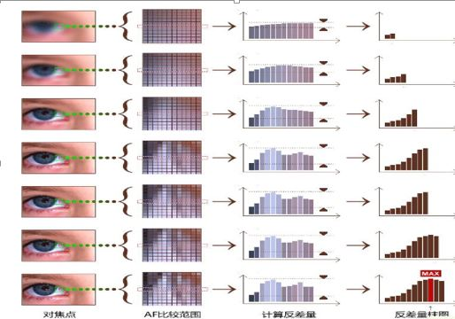

# 
反差对焦与相位对焦

-----------------------------------------------------------------------------------
 

## 1.1 基本概述
通常而言相机的自动对焦方式有两种：**反差对焦**和**相位对焦**。反差对焦的原理是根据焦点处画面的对比度变化，寻找对比度最大时的镜头位置，也就是准确对焦的位置。

首先我们应该明白对焦的原理：图像最清晰的点也是对比度最大的点。

## 1.2 反差对焦
### 1.2.1 工作原理
相机会驱动镜头，沿着指向被摄物的轴线改变对焦点，并在每个对焦点上获取影像，类似于逐点扫描，先将每一个焦点上获得的影像数字化，数字化后的影像实际是一个整数矩阵，并传递给图像处理器，然后计算反差量，对比筛选出反差最大的，驱动镜头，将焦点放置于反差值最大的焦点上，即得到正确的焦点，并根据反差量最大的值确定是否合焦，即对焦完成。所以反映在用户手机屏幕上时，则是由模糊到清晰再到模糊，最终清晰的“拉风箱”式的过程。这种判断能获得非常高的对焦精度，实际使用也是如此。这种对焦技术被称为反差式对焦。

反差式对焦不存在预设的对焦点，或者说，满屏任意部分都可用于对焦，它更适合于一些新的技术结合使用，例如配合触摸技术快速更改对焦区域。

### 1.2.2 影响反差对焦的因素
反差对焦的过程实质上就是一个简单的求最大值的过程，用程序实现也是一个相对简单的事情，并且对处理器的性能要求也并不高。但为何不同厂家的反差对焦的性能千差万别呢？其中主要原因有三个：

1.采样率大小： 
假如在算法完全相同的情况下，完成一次对焦需要采样10帧，那采样帧率越高的芯片对焦速度自然就越快。

2.算法优劣程度： 
反差对焦算法的基本宗旨是，以最少的采样次数来完成对焦。

3.步进马达与镜头的协调性： 
协调性越好，对焦精度也就越高，减少了因错过“最佳对焦点”（也就是上文提到的反差值最大的点）而多次重复对焦的概率。

## 1.3 相位对焦
### 1.3.1 概述
相位对焦——PDAF：它的全称是PhaseDetectionAutoFocus，字面意思就是“相位检测自动对焦”。相位对焦技术在数码相机领域应用已经十分成熟，在智能手机领域则仍处于起步阶段。

### 1.3.2 原理
在感光元件上预留出一些遮蔽像素点，专门用来进行相位检测，通过像素之间的距离及其变化等来决定对焦的偏移值从而实现准确对焦。

手机上的相位对焦则是直接将自动对焦传感器与像素传感器直接集成在一起，即从像素传感器上拿出左右相对的成对像素点，分别对场景中的物体进行进光量等信息的检测，通过比对左右两侧的相关值情况，便会迅速找出准确的对焦点，之后镜间马达便会一次性将镜片推动到相应位置完成对焦。

## 1.4 相位对焦与反差对焦各自的优缺点
### 1.4.1 相位对焦
相比反差对焦，相位对焦不需要镜头的反复移动，对焦行程短了很多，对焦过程干净不犹豫。但另一方面，由于需要利用CMOS上的遮蔽像素点进行相位检测，故此相位对焦对光线强度的要求比较高。

**相位对焦优点：**
 
只需要计算一次就完成对焦，对焦速度极快，并且降低处理器计算负担。

**相位对焦缺点：**
 
在弱光环境下容易对不上焦。

### 1.4.2 反差对焦
反差对焦耗时太长。镜头从开始对焦到最后合焦完毕一直不停移动，“走过站”以后的回退过程更是让对焦行程增大，反映给用户的就是对焦速度较慢。

以拍摄一枚硬币为例，最开始画面是虚焦的状态，随后镜头移动，人们可以看到屏幕中的硬币逐渐清晰起来。直到某一个位置（合焦状态）硬币最为清晰，但摄像头模组自身是意识不到此时已经合焦完毕的，镜头会继续移动，此时人们会看到硬币又变得模糊。这时摄像头模组才意识到镜头“走过站了”，于是回退至刚才清晰的焦点位置，这样一次对焦就完成了。

**反差对焦优点：**
 
物理成本低，弱光环境下也能准确对焦。

**反差对焦缺点：**
 
对焦步骤多，处理器要计算众多数据，并且对焦时间长。

### 1.4.3 总结
**相位对焦相比反差对焦，行程缩短速度加快。**