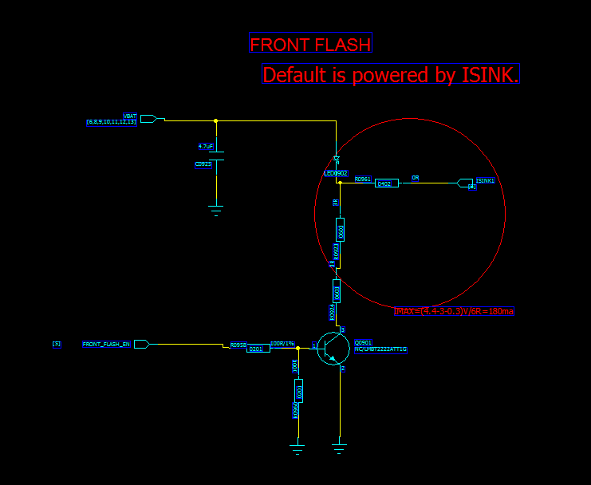
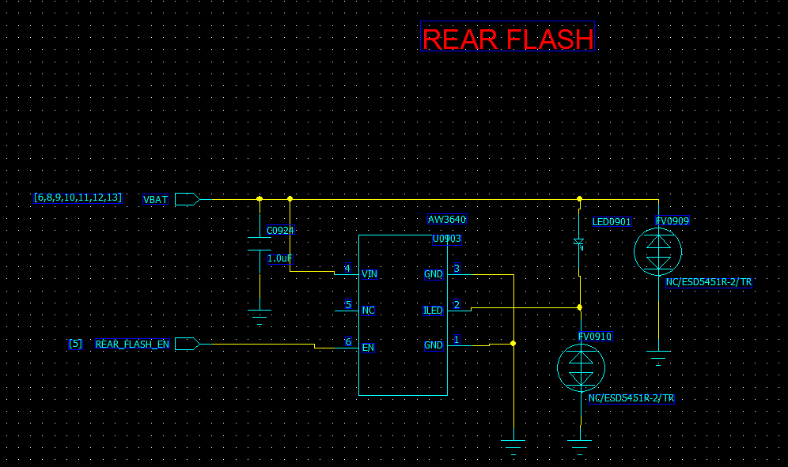

# 
MTK camera flashlight bring up

-----------------------------------------------------------------------------------
 

## 一、查看硬件原理图：
### 1.front camera：

### 2.rear camera：

### 3.key note：
(1)注意第一个前摄flashlight：default is powered by ISINK。这里走的是PMIC，没有使用GPIO。 
(2)第二个后摄flashlight使用的是GPIO控制。

 

## 二、kernel层：
### 1.front camera 添加驱动文件：
**file path**：alps/kernel-3.18/drivers/misc/mediatek/flashlight/src/mt6580/sub_strobe.c

**example**：

	/*
	 * Copyright (C) 2015 MediaTek Inc.
	 *
	 * This program is free software: you can redistribute it and/or modify
	 * it under the terms of the GNU General Public License version 2 as
	 * published by the Free Software Foundation.
	 *
	 * This program is distributed in the hope that it will be useful,
	 * but WITHOUT ANY WARRANTY; without even the implied warranty of
	 * MERCHANTABILITY or FITNESS FOR A PARTICULAR PURPOSE. See the
	 * GNU General Public License for more details.
	 */
	
	
	#include <linux/kernel.h>
	#include <linux/module.h>
	#include <linux/init.h>
	#include <linux/types.h>
	#include <linux/wait.h>
	#include <linux/slab.h>
	#include <linux/fs.h>
	#include <linux/sched.h>
	#include <linux/poll.h>
	#include <linux/device.h>
	#include <linux/interrupt.h>
	#include <linux/delay.h>
	#include <linux/platform_device.h>
	#include <linux/cdev.h>
	#include <linux/errno.h>
	#include <linux/time.h>
	#include <asm/io.h>
	#include <asm/uaccess.h>
	#include "kd_camera_typedef.h"
	#include <linux/hrtimer.h>
	#include <linux/ktime.h>
	#include <linux/version.h>
	#include <mt-plat/mt_gpio.h>
	#ifdef CONFIG_COMPAT
	#include <linux/fs.h>
	#include <linux/compat.h>
	#endif
	#include "kd_flashlight.h"
	/******************************************************************************
	 * Debug configuration
	******************************************************************************/
	/* availible parameter */
	/* ANDROID_LOG_ASSERT */
	/* ANDROID_LOG_ERROR */
	/* ANDROID_LOG_WARNING */
	/* ANDROID_LOG_INFO */
	/* ANDROID_LOG_DEBUG */
	/* ANDROID_LOG_VERBOSE */
	#define TAG_NAME "[sub_strobe.c]"
	#define PK_DBG_NONE(fmt, arg...)    do {} while (0)
	#define PK_DBG_FUNC(fmt, arg...)    pr_debug(TAG_NAME "%s: " fmt, __func__ , ##arg)
	#define PK_WARN(fmt, arg...)        pr_warn(TAG_NAME "%s: " fmt, __func__ , ##arg)
	#define PK_NOTICE(fmt, arg...)      pr_notice(TAG_NAME "%s: " fmt, __func__ , ##arg)
	#define PK_INFO(fmt, arg...)        pr_info(TAG_NAME "%s: " fmt, __func__ , ##arg)
	#define PK_TRC_FUNC(f)              pr_debug(TAG_NAME "<%s>\n", __func__)
	#define PK_TRC_VERBOSE(fmt, arg...) pr_debug(TAG_NAME fmt, ##arg)
	#define PK_ERROR(fmt, arg...)       pr_err(TAG_NAME "%s: " fmt, __func__ , ##arg)
	
	#define DEBUG_LEDS_STROBE
	#ifdef DEBUG_LEDS_STROBE
	#define PK_DBG PK_DBG_FUNC
	#define PK_VER PK_TRC_VERBOSE
	#define PK_ERR PK_ERROR
	#else
	#define PK_DBG(a, ...)
	#define PK_VER(a, ...)
	#define PK_ERR(a, ...)
	#endif
	
	#define CONFIG_FLASHLIGHT_EN_BY_ISINK
	#if defined (CONFIG_FLASHLIGHT_EN_BY_ISINK)
	#include <upmu_common.h>
	enum{
	    C_ISINK_0 = 0, //4mA
	    C_ISINK_1 = 1, //8mA
	    C_ISINK_2 = 2, //12mA
	    C_ISINK_3 = 3, //16mA
	    C_ISINK_4 = 4, //20mA
	    C_ISINK_5 = 5 //24mA
	};
	enum{
	    C_PMIC_PWM_0 = 0,
	    C_PMIC_PWM_1 = 1,
	    C_PMIC_PWM_2 = 2
	};
	
	enum{
	    //32K clock
	    C_ISINK_1KHZ = 0,
	    C_ISINK_200HZ = 4,
	    C_ISINK_5HZ = 199,
	    C_ISINK_2HZ = 499,
	    C_ISINK_1HZ = 999,
	    C_ISINK_05HZ = 1999,
	    C_ISINK_02HZ = 4999,
	    C_ISINK_01HZ = 9999,
	    //2M clock
	    C_ISINK_2M_20KHZ = 2,
	    C_ISINK_2M_1KHZ = 61,
	    C_ISINK_2M_200HZ = 311,
	    C_ISINK_2M_5HZ = 12499,
	    C_ISINK_2M_2HZ = 31249,
	    C_ISINK_2M_1HZ = 62499
	};
	
	#define C_NLED_OFF 0
	#define C_NLED_ON 1
	#endif
	
	static DEFINE_SPINLOCK(g_sub_strobeSMPLock);	/* cotta-- SMP proection */
	
	static u32 strobe_Res;
	static u32 strobe_Timeus;
	static BOOL g_strobe_On;
	
	static int g_duty = -1;
	static int g_timeOutTimeMs;
	
	static struct work_struct workTimeOut;
	
	static int FL_Enable(void)
	{
	#if defined (CONFIG_FLASHLIGHT_EN_BY_ISINK) //internal FL and extennal FL add by zhaoliangming 20160429
	    pmic_set_register_value(PMIC_ISINK_CH1_EN,C_NLED_ON); // Turn on ISINK Channel 1
	    pmic_set_register_value(PMIC_ISINK_CH2_EN,C_NLED_ON); // Turn on ISINK Channel 2
	    pmic_set_register_value(PMIC_ISINK_CH3_EN,C_NLED_ON); // Turn on ISINK Channel 3
	#endif
	
	    return 0;
	}
	
	static int FL_Disable(void)
	{
	#if defined (CONFIG_FLASHLIGHT_EN_BY_ISINK) //internal FL and external FL add by zhaoliangming 20160429
	    pmic_set_register_value(PMIC_ISINK_CH1_EN,C_NLED_OFF); // Turn off ISINK Channel 1
	    pmic_set_register_value(PMIC_ISINK_CH2_EN,C_NLED_OFF); // Turn off ISINK Channel 2
	    pmic_set_register_value(PMIC_ISINK_CH3_EN,C_NLED_OFF); // Turn off ISINK Channel 3
	#endif
	
	    return 0;
	}
	
	static int FL_dim_duty(kal_uint32 duty)
	{
		PK_DBG(" FL_dim_duty line=%d\n", __LINE__);
		g_duty = duty;
		if(duty <32 )
		{
			pmic_set_register_value(PMIC_ISINK_DIM1_DUTY,duty);
			pmic_set_register_value(PMIC_ISINK_DIM2_DUTY,duty);
			pmic_set_register_value(PMIC_ISINK_DIM3_DUTY,duty);
		}
		
		return 0;
	}
	
	static int FL_Init(void)
	{
	#if defined (CONFIG_FLASHLIGHT_EN_BY_ISINK)
	    pmic_set_register_value(PMIC_RG_DRV_32K_CK_PDN,0x0); // Disable power down
	    pmic_set_register_value(PMIC_RG_ISINK1_CK_PDN,0);
	    pmic_set_register_value(PMIC_RG_ISINK1_CK_SEL,0);
	    pmic_set_register_value(PMIC_ISINK_CH1_MODE,C_PMIC_PWM_2);//register mode
	    pmic_set_register_value(PMIC_ISINK_CH1_STEP,C_ISINK_5);//24mA
	    pmic_set_register_value(PMIC_ISINK_DIM1_DUTY,31);
	    pmic_set_register_value(PMIC_ISINK_DIM1_FSEL,C_ISINK_1KHZ);//1KHz
	    pmic_set_register_value(PMIC_RG_ISINK1_DOUBLE_EN,0x1); // Enable double current
	
		pmic_set_register_value(PMIC_RG_DRV_32K_CK_PDN,0x0); // Disable power down
	    pmic_set_register_value(PMIC_RG_ISINK2_CK_PDN,0);
	    pmic_set_register_value(PMIC_RG_ISINK2_CK_SEL,0);
	    pmic_set_register_value(PMIC_ISINK_CH2_MODE,C_PMIC_PWM_2);//register mode
	    pmic_set_register_value(PMIC_ISINK_CH2_STEP,C_ISINK_5);//24mA
	    pmic_set_register_value(PMIC_ISINK_DIM2_DUTY,31);
	    pmic_set_register_value(PMIC_ISINK_DIM2_FSEL,C_ISINK_1KHZ);//1KHz
	    pmic_set_register_value(PMIC_RG_ISINK2_DOUBLE_EN,0x1); // Enable double current
	
		pmic_set_register_value(PMIC_RG_DRV_32K_CK_PDN,0x0); // Disable power down
	    pmic_set_register_value(PMIC_RG_ISINK3_CK_PDN,0);
	    pmic_set_register_value(PMIC_RG_ISINK3_CK_SEL,0);
	    pmic_set_register_value(PMIC_ISINK_CH3_MODE,C_PMIC_PWM_2);//register mode
	    pmic_set_register_value(PMIC_ISINK_CH3_STEP,C_ISINK_5);//24mA
	    pmic_set_register_value(PMIC_ISINK_DIM3_DUTY,31);
	    pmic_set_register_value(PMIC_ISINK_DIM3_FSEL,C_ISINK_1KHZ);//1KHz
	    pmic_set_register_value(PMIC_RG_ISINK3_DOUBLE_EN,0x1); // Enable double current
	#endif
	
		return 0;
	}
	
	static int FL_Uninit(void)
	{
		return 0;
	}
	
	/*****************************************************************************
	User interface
	*****************************************************************************/
	
	static void work_timeOutFunc(struct work_struct *data)
	{
		FL_Disable();
		PK_DBG("ledTimeOut_callback\n");
	}
	
	static enum hrtimer_restart ledTimeOutCallback(struct hrtimer *timer)
	{
		schedule_work(&workTimeOut);
		return HRTIMER_NORESTART;
	}
	
	static struct hrtimer g_timeOutTimer;
	static void timerInit(void)
	{
		static int init_flag;
	
		if (init_flag == 0) {
			init_flag = 1;
			INIT_WORK(&workTimeOut, work_timeOutFunc);
			g_timeOutTimeMs = 1000;
			hrtimer_init(&g_timeOutTimer, CLOCK_MONOTONIC, HRTIMER_MODE_REL);
			g_timeOutTimer.function = ledTimeOutCallback;
		}
	}
	
	static int sub_strobe_ioctl(unsigned int cmd, unsigned long arg)
	{
		int i4RetValue = 0;
		int ior_shift;
		int iow_shift;
		int iowr_shift;
	
		ior_shift = cmd - (_IOR(FLASHLIGHT_MAGIC, 0, int));
		iow_shift = cmd - (_IOW(FLASHLIGHT_MAGIC, 0, int));
		iowr_shift = cmd - (_IOWR(FLASHLIGHT_MAGIC, 0, int));
	
	    printk(KERN_ERR "koson!!!!! %s:%d  cmd=%d   arg=%ld\n", __func__, __LINE__, cmd, arg);
	
	/*	PK_DBG
		    ("LM3642 constant_flashlight_ioctl() line=%d ior_shift=%d, iow_shift=%d iowr_shift=%d arg=%d\n",
		     __LINE__, ior_shift, iow_shift, iowr_shift, (int)arg);
	*/
		switch (cmd) {
	
		case FLASH_IOC_SET_TIME_OUT_TIME_MS:
			PK_DBG("FLASH_IOC_SET_TIME_OUT_TIME_MS: %d\n", (int)arg);
			g_timeOutTimeMs = arg;
			break;
	
	
		case FLASH_IOC_SET_DUTY:
			PK_DBG("FLASHLIGHT_DUTY: %d\n", (int)arg);
			FL_dim_duty(arg);
			break;
	
	
		case FLASH_IOC_SET_STEP:
			PK_DBG("FLASH_IOC_SET_STEP: %d\n", (int)arg);
			break;
	
		case FLASH_IOC_SET_ONOFF:
			PK_DBG("FLASHLIGHT_ONOFF: %d\n", (int)arg);
			if (arg == 1) {
	
				int s;
				int ms;
	
				if (g_timeOutTimeMs > 1000) {
					s = g_timeOutTimeMs / 1000;
					ms = g_timeOutTimeMs - s * 1000;
				} else {
					s = 0;
					ms = g_timeOutTimeMs;
				}
	
				if (g_timeOutTimeMs != 0) {
					ktime_t ktime;
	
					ktime = ktime_set(s, ms * 1000000);
					hrtimer_start(&g_timeOutTimer, ktime, HRTIMER_MODE_REL);
				}
				FL_Enable();
			} else {
				FL_Disable();
				hrtimer_cancel(&g_timeOutTimer);
			}
			break;
		default:
			PK_DBG(" No such command\n");
			i4RetValue = -EPERM;
			break;
		}
		return i4RetValue;
	}
	
	static int sub_strobe_open(void *pArg)
	{
		int i4RetValue = 0;
	
		PK_DBG("constant_flashlight_open line=%d\n", __LINE__);
	
		if (0 == strobe_Res) {
			FL_Init();
			timerInit();
		}
		PK_DBG("constant_flashlight_open line=%d\n", __LINE__);
		spin_lock_irq(&g_sub_strobeSMPLock);
	
	
		if (strobe_Res) {
			PK_DBG(" busy!\n");
			i4RetValue = -EBUSY;
		} else {
			strobe_Res += 1;
		}
	
	
		spin_unlock_irq(&g_sub_strobeSMPLock);
		PK_DBG("constant_flashlight_open line=%d\n", __LINE__);
	
		return i4RetValue;
	}
	
	static int sub_strobe_release(void *pArg)
	{
		PK_DBG(" constant_flashlight_release\n");
	
		if (strobe_Res) {
			spin_lock_irq(&g_sub_strobeSMPLock);
	
			strobe_Res = 0;
			strobe_Timeus = 0;
	
			/* LED On Status */
			g_strobe_On = FALSE;
	
			spin_unlock_irq(&g_sub_strobeSMPLock);
	
			FL_Uninit();
		}
	
		PK_DBG(" Done\n");
	
		return 0;
	}
	
	FLASHLIGHT_FUNCTION_STRUCT subStrobeFunc = {
		sub_strobe_open,
		sub_strobe_release,
		sub_strobe_ioctl
	};
	
	
	MUINT32 subStrobeInit(PFLASHLIGHT_FUNCTION_STRUCT *pfFunc)
	{
		if (pfFunc != NULL)
			*pfFunc = &subStrobeFunc;
		return 0;
	}

**key note**：此处前摄是PMU ISINK控制，虽然原理图上标号为ISINK1，但是它是由ISINK1，2，3组合而成的。

### 2.rear camera 添加驱动文件：
**file path**：alps/kernel-3.18/drivers/misc/mediatek/flashlight/src/mt6580/constant_flashlight/leds_strobe.c

**example**：

	/*
	 * Copyright (C) 2015 MediaTek Inc.
	 *
	 * This program is free software: you can redistribute it and/or modify
	 * it under the terms of the GNU General Public License version 2 as
	 * published by the Free Software Foundation.
	 *
	 * This program is distributed in the hope that it will be useful,
	 * but WITHOUT ANY WARRANTY; without even the implied warranty of
	 * MERCHANTABILITY or FITNESS FOR A PARTICULAR PURPOSE. See the
	 * GNU General Public License for more details.
	 */
	
	#include <linux/kernel.h>
	#include <linux/module.h>
	#include <linux/init.h>
	#include <linux/types.h>
	#include <linux/wait.h>
	#include <linux/slab.h>
	#include <linux/fs.h>
	#include <linux/sched.h>
	#include <linux/poll.h>
	#include <linux/device.h>
	#include <linux/interrupt.h>
	#include <linux/delay.h>
	#include <linux/platform_device.h>
	#include <linux/cdev.h>
	#include <linux/errno.h>
	#include <linux/time.h>
	#include <linux/gpio.h>
	#include "kd_flashlight.h"
	#include <asm/io.h>
	#include <asm/uaccess.h>
	#include <mt-plat/mt_gpio.h>
	#include "kd_camera_typedef.h"
	#include <linux/hrtimer.h>
	#include <linux/ktime.h>
	#include <linux/version.h>
	#include <linux/mutex.h>
	#include <linux/i2c.h>
	#include <linux/leds.h>
	#include <mt-plat/mt_pwm.h>
	
	#include "../../../../imgsensor/src/mt6580/camera_hw/kd_camera_hw.h"
	
	#define GPIO8 8
	
	/******************************************************************************
	 * Debug configuration
	******************************************************************************/
	/* availible parameter */
	/* ANDROID_LOG_ASSERT */
	/* ANDROID_LOG_ERROR */
	/* ANDROID_LOG_WARNING */
	/* ANDROID_LOG_INFO */
	/* ANDROID_LOG_DEBUG */
	/* ANDROID_LOG_VERBOSE */
	
	#define TAG_NAME "[leds_strobe.c]"
	#define PK_DBG_NONE(fmt, arg...)    do {} while (0)
	#define PK_DBG_FUNC(fmt, arg...)    pr_debug(TAG_NAME "%s: " fmt, __func__ , ##arg)
	
	/*#define DEBUG_LEDS_STROBE*/
	#ifdef DEBUG_LEDS_STROBE
	#define PK_DBG PK_DBG_FUNC
	#else
	#define PK_DBG(a, ...)
	#endif
	
	/******************************************************************************
	 * local variables
	******************************************************************************/
	
	static DEFINE_SPINLOCK(g_strobeSMPLock);	/* cotta-- SMP proection */
	
	static u32 strobe_Res;
	static u32 strobe_Timeus;
	static BOOL g_strobe_On;
	
	static int g_duty = -1;
	static int g_timeOutTimeMs;
	
	static DEFINE_MUTEX(g_strobeSem);
	
	
	#define STROBE_DEVICE_ID 0xC6
	
	
	static struct work_struct workTimeOut;
	
	/* #define FLASH_GPIO_ENF GPIO12 */
	/* #define FLASH_GPIO_ENT GPIO13 */
	
	//static int g_bLtVersion;
	
	static struct pwm_spec_config pwm_setting;
	
	
	/*****************************************************************************
	Functions
	*****************************************************************************/
	static void work_timeOutFunc(struct work_struct *data);
	
	int FL_Enable(void)
	{
	    pwm_set_spec_config(&pwm_setting);
	
	    return 0;
	}
	
	int FL_Disable(void)
	{
	    mt_pwm_disable(PWM1,0);
	
	    return 0;
	}
	
	int FL_dim_duty(kal_uint32 duty)
	{
		PK_DBG(" FL_dim_duty line=%d\n", __LINE__);
	
		g_duty = duty;
	
	    if(duty == 0)
	        pwm_setting.PWM_MODE_OLD_REGS.THRESH = 16;
	    else if (duty == 1)
	        pwm_setting.PWM_MODE_OLD_REGS.THRESH = 8;
	    else if (duty > 16)
	        pwm_setting.PWM_MODE_OLD_REGS.THRESH = 16;
	    else
	        pwm_setting.PWM_MODE_OLD_REGS.THRESH = duty;
	
		return 0;
	}
	
	int FL_Init(void)
	{
	
		mt_set_gpio_mode(GPIO8, GPIO_MODE_02);
		pwm_setting.pwm_no = PWM1;
		pwm_setting.pmic_pad = 0;
	#ifdef PWM_FIFO_1
		pwm_setting.mode = PWM_MODE_FIFO;
		pwm_setting.clk_div=CLK_DIV1;
		pwm_setting.clk_src = PWM_CLK_NEW_MODE_BLOCK_DIV_BY_1625;
		
		pwm_setting.PWM_MODE_FIFO_REGS.IDLE_VALUE = 0;
		pwm_setting.PWM_MODE_FIFO_REGS.GUARD_VALUE = 0;
		pwm_setting.PWM_MODE_FIFO_REGS.STOP_BITPOS_VALUE = 31;
		pwm_setting.PWM_MODE_FIFO_REGS.HDURATION = 4;
	    pwm_setting.PWM_MODE_FIFO_REGS.LDURATION = 4;
		pwm_setting.PWM_MODE_FIFO_REGS.GDURATION =
	    (pwm_setting.PWM_MODE_FIFO_REGS.HDURATION + 1) * 32 - 1;
		pwm_setting.PWM_MODE_FIFO_REGS.GUARD_VALUE = 1;
		pwm_setting.PWM_MODE_FIFO_REGS.SEND_DATA0 =50;
		pwm_setting.PWM_MODE_FIFO_REGS.WAVE_NUM = 0;
	#else
		pwm_setting.mode = PWM_MODE_OLD;
		pwm_setting.clk_div=CLK_DIV1;
		pwm_setting.clk_src = PWM_CLK_OLD_MODE_BLOCK;
		pwm_setting.PWM_MODE_OLD_REGS.IDLE_VALUE = 0;
		pwm_setting.PWM_MODE_OLD_REGS.GUARD_VALUE = 0;
		pwm_setting.PWM_MODE_OLD_REGS.GDURATION = 0;
		pwm_setting.PWM_MODE_OLD_REGS.WAVE_NUM = 0;
		pwm_setting.PWM_MODE_OLD_REGS.DATA_WIDTH = 16;
		pwm_setting.PWM_MODE_OLD_REGS.THRESH = 8;
	#endif
	
	/*	PK_DBG(" FL_Init line=%d\n", __LINE__); */
		return 0;
	}
	
	int FL_Uninit(void)
	{
		FL_Disable();
		return 0;
	}
	
	/*****************************************************************************
	User interface
	*****************************************************************************/
	
	static void work_timeOutFunc(struct work_struct *data)
	{
		FL_Disable();
		PK_DBG("ledTimeOut_callback\n");
	}
	
	enum hrtimer_restart ledTimeOutCallback(struct hrtimer *timer)
	{
		schedule_work(&workTimeOut);
		return HRTIMER_NORESTART;
	}
	
	static struct hrtimer g_timeOutTimer;
	void timerInit(void)
	{
		static int init_flag;
	
		if (init_flag == 0) {
			init_flag = 1;
			INIT_WORK(&workTimeOut, work_timeOutFunc);
			g_timeOutTimeMs = 1000;
			hrtimer_init(&g_timeOutTimer, CLOCK_MONOTONIC, HRTIMER_MODE_REL);
			g_timeOutTimer.function = ledTimeOutCallback;
		}
	}
	
	static int constant_flashlight_ioctl(unsigned int cmd, unsigned long arg)
	{
		int i4RetValue = 0;
		int ior_shift;
		int iow_shift;
		int iowr_shift;
	
		ior_shift = cmd - (_IOR(FLASHLIGHT_MAGIC, 0, int));
		iow_shift = cmd - (_IOW(FLASHLIGHT_MAGIC, 0, int));
		iowr_shift = cmd - (_IOWR(FLASHLIGHT_MAGIC, 0, int));
	
		switch (cmd) {
	
		case FLASH_IOC_SET_TIME_OUT_TIME_MS:
			PK_DBG("FLASH_IOC_SET_TIME_OUT_TIME_MS: %d\n", (int)arg);
			g_timeOutTimeMs = arg;
			break;
	
	
		case FLASH_IOC_SET_DUTY:
			PK_DBG("FLASHLIGHT_DUTY: %d\n", (int)arg);
			FL_dim_duty(arg);
			break;
	
	
		case FLASH_IOC_SET_STEP:
			PK_DBG("FLASH_IOC_SET_STEP: %d\n", (int)arg);
	
			break;
	
		case FLASH_IOC_SET_ONOFF:
			PK_DBG("FLASHLIGHT_ONOFF: %d\n", (int)arg);
			if (arg == 1) {
	
				int s;
				int ms;
	
				if (g_timeOutTimeMs > 1000) {
					s = g_timeOutTimeMs / 1000;
					ms = g_timeOutTimeMs - s * 1000;
				} else {
					s = 0;
					ms = g_timeOutTimeMs;
				}
	
				if (g_timeOutTimeMs != 0) {
					ktime_t ktime;
	
					ktime = ktime_set(s, ms * 1000000);
					hrtimer_start(&g_timeOutTimer, ktime, HRTIMER_MODE_REL);
				}
				FL_Enable();
			} else {
				FL_Disable();
				hrtimer_cancel(&g_timeOutTimer);
			}
			break;
		default:
			PK_DBG(" No such command\n");
			i4RetValue = -EPERM;
			break;
		}
		return i4RetValue;
	}
	
	static int constant_flashlight_open(void *pArg)
	{
		int i4RetValue = 0;
	
		PK_DBG("constant_flashlight_open line=%d\n", __LINE__);
	
		if (0 == strobe_Res) {
			FL_Init();
			timerInit();
		}
		PK_DBG("constant_flashlight_open line=%d\n", __LINE__);
		spin_lock_irq(&g_strobeSMPLock);
	
	
		if (strobe_Res) {
			PK_DBG(" busy!\n");
			i4RetValue = -EBUSY;
		} else {
			strobe_Res += 1;
		}
	
	
		spin_unlock_irq(&g_strobeSMPLock);
		PK_DBG("constant_flashlight_open line=%d\n", __LINE__);
	
		return i4RetValue;
	
	}
	
	static int constant_flashlight_release(void *pArg)
	{
		PK_DBG(" constant_flashlight_release\n");
	
		if (strobe_Res) {
			spin_lock_irq(&g_strobeSMPLock);
	
			strobe_Res = 0;
			strobe_Timeus = 0;
	
			/* LED On Status */
			g_strobe_On = FALSE;
	
			spin_unlock_irq(&g_strobeSMPLock);
	
			FL_Uninit();
		}
	
		PK_DBG(" Done\n");
	
		return 0;
	
	}
	
	FLASHLIGHT_FUNCTION_STRUCT constantFlashlightFunc = {
		constant_flashlight_open,
		constant_flashlight_release,
		constant_flashlight_ioctl
	};
	
	MUINT32 constantFlashlightInit(PFLASHLIGHT_FUNCTION_STRUCT *pfFunc)
	{
		if (pfFunc != NULL)
			*pfFunc = &constantFlashlightFunc;
		return 0;
	}
	
	/* LED flash control for high current capture mode*/
	ssize_t strobe_VDIrq(void)
	{
	
		return 0;
	}
	EXPORT_SYMBOL(strobe_VDIrq);

 

## 二、hal层：
### 1.front camera 打开flashlight宏控制：
**file path**：alps/vendor/mediatek/proprietary/custom/mt6580/hal/flashlight/flash_tuning_custom2.h

**example**：

	#define SUB_FLASH_SUPPORT 1