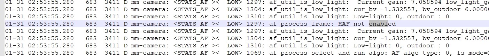
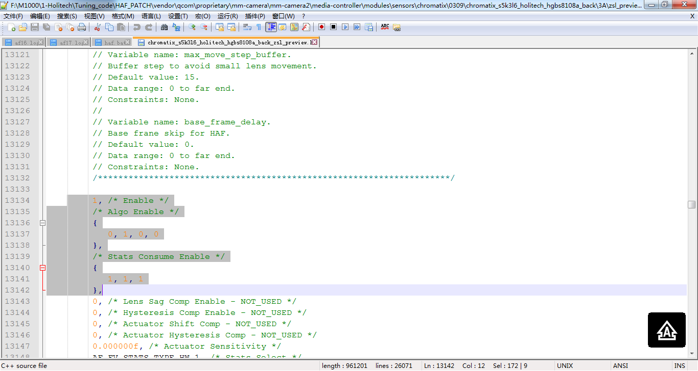

# 
Qualcomm AF bug

-----------------------------------------------------------------------------------
 

## 1.1 PDAF功能未生效，读取不到数据。

### 1.1.1 Log分析
	01-01 04:41:30.987   813  3215 I mm-camera: <SENSOR>< INFO> 3668: sensor_get_resolution_info: sensor info: name: s5k3l6, res: 0, max_fps: 30.000000, w: 4208, h: 3120 op pix clk: 480000000, FLL: 3260, LLPCK: 4896, mode: 1, PDAF support: 1
	01-01 04:41:30.988   813  3215 D mm-camera: <STATS ><  LOW> 2003: stats_port_event: STAT_EVENT: MCT_EVENT_MODULE_SET_STREAM_CONFIG Dir 1
	01-01 04:41:30.988   813  3215 D mm-camera: <STATS_AF ><  LOW> 3994: af_port_handle_module_event: Handle AF module event of type: 0
	01-01 04:41:30.988   813  3215 D mm-camera: <STATS_AF ><  LOW> 3158: af_port_handle_sensor_update: Sensor Res width: 4208 height: 3120 FocalLength: 3.030000 and FNum: 2.000000
	01-01 04:41:30.988   813  3215 E mm-camera: <STATS_AF ><ERROR> 3167: af_port_handle_sensor_update: Depth_Err: actuator sensitivity: 0.000000 is invalid
	01-01 04:41:30.988   813  3215 D mm-camera: <STATS_AF ><  LOW> 3173: af_port_handle_sensor_update: Depth_Err: pdaf cal data from sensor supported 1 pdaf_ptr 0xabf29b50
	01-01 04:41:30.988   813  3215 I mm-camera: <CPP   >< INFO> 1734: cpp_module_handle_stream_cfg_event: frame_offset=3, input_fps=30.00, identity=0x2000f
	01-01 04:41:30.988   813  3215 I mm-camera: <CPP   >< INFO> 1734: cpp_module_handle_stream_cfg_event: frame_offset=3, input_fps=30.00, identity=0x20002
	01-01 04:41:30.989   813  3215 D mm-camera: <STATS ><  LOW> 2003: stats_port_event: STAT_EVENT: MCT_EVENT_MODULE_SENSOR_PDAF_CONFIG Dir 1
	01-01 04:41:30.989   813  1070 D QCameraQuadraCfa: img_algo_preload:126 : E
	01-01 04:41:30.989   813  3215 D mm-camera: <STATS_AF ><  LOW> 3994: af_port_handle_module_event: Handle AF module event of type: 135
	01-01 04:41:30.989   813  1070 D QCameraQuadraCfa: PresetConfig:495 : E
	01-01 04:41:30.989   813  3215 D mm-camera: <STATS_AF ><  LOW> 4261: af_port_handle_module_event: Default. no action!
	01-01 04:41:30.989   813  1070 D QCameraQuadraCfa: PresetConfig:497 : custom_cal_data  0
	01-01 04:41:30.989   813  1070 D QCameraQuadraCfa: PresetConfig:498 : full_height  c30
	01-01 04:41:30.989   813  1070 D QCameraQuadraCfa: PresetConfig:499 : full_width  1070
	01-01 04:41:30.989   813  1070 D QCameraQuadraCfa: PresetConfig:500 : filter_arrangement  2
	01-01 04:41:30.989   813  1070 D QCameraQuadraCfa: PresetConfig:501 : pedestal  40
	01-01 04:41:30.989   813  1070 E quadracfa_dummy: inside dummy remosaic_init 1
	01-01 04:41:30.989   813  3211 D mm-camera: <STATS_AF ><  LOW> 2784: af_biz_set_parameters:  param=0xa33f6010 af_obj=0xaac54000, type =20
	01-01 04:41:30.989   813  1070 E quadracfa_dummy: inside dummy remosaic_gainmap_gen 1
	01-01 04:41:30.989   813  1070 D QCameraQuadraCfa: PresetConfig:515 : X
	01-01 04:41:30.989   813  1070 D QCameraQuadraCfa: img_algo_preload:128 : X
	01-01 04:41:30.989   813  3211 D mm-camera: <STATS_AF ><  LOW> 2784: af_biz_set_parameters:  param=0xa33f8810 af_obj=0xaac54000, type =25
	01-01 04:41:30.989   813  3211 D mm-camera: <STATS_AF ><  LOW> 2835: af_biz_set_parameters: Stream type=1
	01-01 04:41:30.989   813  3215 I mm-camera: <SENSOR>< INFO> 3010: sensor_get_cur_chromatix_name: res_idx = 0 chromatix_lib_name[0] = s5k3l6_holitech_hgbs8108a_back_snapshot
	01-01 04:41:30.989   813  3215 I mm-camera: <SENSOR>< INFO> 3010: sensor_get_cur_chromatix_name: res_idx = 0 chromatix_lib_name[1] = s5k3l6_holitech_hgbs8108a_back_snapshot
	01-01 04:41:30.989   813  3215 I mm-camera: <SENSOR>< INFO> 3010: sensor_get_cur_chromatix_name: res_idx = 0 chromatix_lib_name[2] = s5k3l6_holitech_hgbs8108a_back_common
	01-01 04:41:30.989   813  3215 I mm-camera: <SENSOR>< INFO> 3010: sensor_get_cur_chromatix_name: res_idx = 0 chromatix_lib_name[3] = s5k3l6_holitech_hgbs8108a_back_cpp_preview
	01-01 04:41:30.989   813  3215 I mm-camera: <SENSOR>< INFO> 3010: sensor_get_cur_chromatix_name: res_idx = 0 chromatix_lib_name[4] = s5k3l6_holitech_hgbs8108a_back_cpp_snapshot
	01-01 04:41:30.989   813  3215 I mm-camera: <SENSOR>< INFO> 3010: sensor_get_cur_chromatix_name: res_idx = 0 chromatix_lib_name[5] = s5k3l6_holitech_hgbs8108a_back_cpp_snapshot
	01-01 04:41:30.989   813  3215 I mm-camera: <SENSOR>< INFO> 3010: sensor_get_cur_chromatix_name: res_idx = 0 chromatix_lib_name[6] = s5k3l6_holitech_hgbs8108a_back_cpp_snapshot
	01-01 04:41:30.989   813  3215 I mm-camera: <SENSOR>< INFO> 3010: sensor_get_cur_chromatix_name: res_idx = 0 chromatix_lib_name[7] = s5k3l6_holitech_hgbs8108a_back_cpp_snapshot
	01-01 04:41:30.989   813  3215 I mm-camera: <SENSOR>< INFO> 3010: sensor_get_cur_chromatix_name: res_idx = 0 chromatix_lib_name[8] = s5k3l6_holitech_hgbs8108a_back_cpp_snapshot
	01-01 04:41:30.989   813  3215 I mm-camera: <SENSOR>< INFO> 3010: sensor_get_cur_chromatix_name: res_idx = 0 chromatix_lib_name[9] = s5k3l6_holitech_hgbs8108a_back_cpp_snapshot
	01-01 04:41:30.989   813  3215 I mm-camera: <SENSOR>< INFO> 3010: sensor_get_cur_chromatix_name: res_idx = 0 chromatix_lib_name[10] = s5k3l6_holitech_hgbs8108a_back_cpp_snapshot
	01-01 04:41:30.989   813  3215 I mm-camera: <SENSOR>< INFO> 3010: sensor_get_cur_chromatix_name: res_idx = 0 chromatix_lib_name[11] = s5k3l6_holitech_hgbs8108a_back_cpp_video
	01-01 04:41:30.989   813  3215 I mm-camera: <SENSOR>< INFO> 3010: sensor_get_cur_chromatix_name: res_idx = 0 chromatix_lib_name[12] = s5k3l6_holitech_hgbs8108a_back_postproc
	01-01 04:41:30.989   813  3215 I mm-camera: <SENSOR>< INFO> 3010: sensor_get_cur_chromatix_name: res_idx = 0 chromatix_lib_name[13] = s5k3l6_holitech_hgbs8108a_back_zsl_preview
	01-01 04:41:30.990   813  3215 E mm-camera: s5k3l6_holitech_hgbs8108a_back_eeprom_get_calibration_items:38,is_wbc:1,is_afc:1,is_lsc:1,is_dpc:0,is_insensor:0,
	01-01 04:41:30.998   813  3215 D mm-camera: <STATS ><  LOW> 2003: stats_port_event: STAT_EVENT: MCT_EVENT_MODULE_SET_CHROMATIX_PTR Dir 1
	01-01 04:41:30.998   813  3215 D mm-camera: <STATS >< HIGH> 2208: stats_port_event: Got Chromatix or new tune values, type: 6
	01-01 04:41:30.998   813  3215 D mm-camera: <STATS ><  LOW> 2217: stats_port_event: Filling in 3A common debug data information.
	01-01 04:41:30.998   813  3215 D mm-camera: <STATS_AF ><  LOW> 5707: af_port_handle_control_event: AF not supported yet! control evt=5
	01-01 04:41:30.999   813  3215 D mm-camera: <STATS_AF ><  LOW> 3994: af_port_handle_module_event: Handle AF module event of type: 6
	01-01 04:41:30.999   813  3215 D mm-camera: <STATS_AF ><  LOW> 2575: af_port_set_haf_enable: HAF Disable Setprop mask: 0
	01-01 04:41:30.999   813  3215 D mm-camera: <STATS_AF ><  LOW> 2589: af_port_set_haf_enable: PDAF is being disabled as supported=0 and LIB Presence=1
	01-01 04:41:30.999   813  3215 D mm-camera: <STATS_AF ><  LOW> 2598: af_port_set_haf_enable: DCiAF is being disabled
	01-01 04:41:31.004   813  3211 D mm-camera: <STATS_AF ><  LOW> 2784: af_biz_set_parameters:  param=0xa33f8810 af_obj=0xaac54000, type =52
	01-01 04:41:31.004   813  3211 D mm-camera: <STATS_AF ><  LOW> 364: af_core_set_param:  param_type=7
	01-01 04:41:31.004   813  3211 D mm-camera: <STATS_AF ><  LOW> 550: af_map_output_params: type=0
	01-01 04:41:31.004   813  3211 D mm-camera: <STATS_AF ><  LOW> 2539: af_biz_handle_core_output:  type=512
	01-01 04:41:31.005   813  3211 D mm-camera: <STATS_AF ><  LOW> 80: af_biz_util_update_output_data:  Update output data of type: 1048576
	01-01 04:41:31.005   813  3211 D mm-camera: <STATS_AF ><  LOW> 1804: af_port_callback: output mask= 100000
	01-01 04:41:31.005   813  3211 D mm-camera: <STATS_AF ><  LOW> 2013: af_port_callback: X
	01-01 04:41:31.005   813  3211 D mm-camera: <STATS_AF ><  LOW> 2784: af_biz_set_parameters:  param=0xa33f6010 af_obj=0xaac54000, type =1
	01-01 04:41:31.005   813  3211 D mm-camera: <STATS_AF ><  LOW> 2754: af_biz_get_search_limit: index: 0 near_end: 0 far_end: 560 default: 329
	01-01 04:41:31.005   813  3211 D mm-camera: <STATS_AF ><  LOW> 2754: af_biz_get_search_limit: index: 1 near_end: 0 far_end: 560 default: 329
	01-01 04:41:31.005   813  3211 D mm-camera: <STATS_AF ><  LOW> 2754: af_biz_get_search_limit: index: 2 near_end: 0 far_end: 560 default: 329
	01-01 04:41:31.005   813  3211 D mm-camera: <STATS_AF ><  LOW> 2754: af_biz_get_search_limit: index: 3 near_end: 0 far_end: 560 default: 329
	01-01 04:41:31.005   813  3211 D mm-camera: <STATS_AF ><  LOW> 2754: af_biz_get_search_limit: index: 4 near_end: 0 far_end: 560 default: 329
	01-01 04:41:31.005   813  3211 D mm-camera: <STATS_AF ><  LOW> 364: af_core_set_param:  param_type=6
	01-01 04:41:31.005   813  3211 D mm-camera: <STATS_HAF ><  LOW> 1229: af_haf_update_tuning_data: E
	01-01 04:41:31.005   813  3211 D mm-camera: <STATS_HAF ><  LOW> 1254: af_haf_update_tuning_data: Chromatix is_2PD_enable : 0
	01-01 04:41:31.005   813  3211 D mm-camera: <STATS_HAF ><  LOW> 322: af_haf_mixer_set_tuning: E
	01-01 04:41:31.005   813  3211 D mm-camera: <STATS_HAF ><  LOW> 231: af_haf_mixer_algo_selection: E
	01-01 04:41:31.005   813  3211 D mm-camera: <STATS_HAF ><  LOW> 248: af_haf_mixer_algo_selection: Selecting Default Mixer
	01-01 04:41:31.005   813  3211 D mm-camera: <STATS_HAF ><  LOW> 1107: af_follower_set_tuning: Tuning is being set
	01-01 04:41:31.005   813  3211 D mm-camera: <STATS_HAF ><  LOW> 929: af_follower_populate_extendedtuning: Extended Tuning is being Populated as its not present in tuning
	01-01 04:41:31.005   813  3211 D mm-camera: <STATS_HAF >< HIGH> 884: af_follower_print_tuning: gravity_comp_on=0
	01-01 04:41:31.005   813  3211 D mm-camera: <STATS_HAF >< HIGH> 885: af_follower_print_tuning: lowLightThreshold=3
	01-01 04:41:31.005   813  3211 D mm-camera: <STATS_HAF >< HIGH> 886: af_follower_print_tuning: useFineSearchExtension=0
	01-01 04:41:31.005   813  3211 D mm-camera: <STATS_HAF >< HIGH> 887: af_follower_print_tuning: macroRegionThreshold_in_mm=200
	01-01 04:41:31.005   813  3211 D mm-camera: <STATS_HAF >< HIGH> 888: af_follower_print_tuning: farRegionThresholdin_mm=5000
	01-01 04:41:31.005   813  3211 D mm-camera: <STATS_HAF >< HIGH> 892: af_follower_print_tuning: Normal Light MACRO_RANGE stepSize=12 far_steps=4 near_steps=4
	01-01 04:41:31.005   813  3211 D mm-camera: <STATS_HAF >< HIGH> 896: af_follower_print_tuning: Normal Light MID_RANGE stepSize=12 far_steps=4 near_steps=4
	01-01 04:41:31.005   813  3211 D mm-camera: <STATS_HAF >< HIGH> 900: af_follower_print_tuning: Normal Light FAR_RANGE stepSize=12 far_steps=4 near_steps=4
	01-01 04:41:31.005   813  3211 D mm-camera: <STATS_HAF >< HIGH> 904: af_follower_print_tuning: Low Light MACRO_RANGE stepSize=12 far_steps=4 near_steps=4
	01-01 04:41:31.005   813  3211 D mm-camera: <STATS_HAF >< HIGH> 908: af_follower_print_tuning: Low Light MID_RANGE stepSize=12 far_steps=4 near_steps=4
	01-01 04:41:31.006   813  3211 D mm-camera: <STATS_HAF >< HIGH> 912: af_follower_print_tuning: Low Light FAR_RANGE stepSize=12 far_steps=4 near_steps=4
	01-01 04:41:31.006   813  3211 D mm-camera: <STATS_AF >< HIGH> 292: af_haf_default_mixer_active_algo_selection: WARNING! Unable to find active mixer algo !! 
	01-01 04:41:31.006   813  3211 D mm-camera: <STATS_HAF ><  LOW> 264: af_haf_mixer_set_parameters: E
	01-01 04:41:31.006   813  3211 D mm-camera: <STATS_HAF ><  LOW> 737: af_haf_init_data: E
	01-01 04:41:31.006   813  3211 D mm-camera: <STATS_AF >< HIGH> 792: af_haf_init_data: MASTER_FOLLOW: EnableFollow = 1 LensThreshold = 9 frames2Wait = 10
	01-01 04:41:31.006   813  3211 D mm-camera: <STATS_HAF ><  LOW> 965: af_haf_set_requireDistanceInfo: RequireDistance=1
	01-01 04:41:31.006   813  3211 D mm-camera: <STATS_AF ><  LOW> 550: af_map_output_params: type=0
	01-01 04:41:31.006   813  3211 D mm-camera: <STATS_AF ><  LOW> 2539: af_biz_handle_core_output:  type=512
	01-01 04:41:31.006   813  3211 D mm-camera: <STATS_AF ><  LOW> 80: af_biz_util_update_output_data:  Update output data of type: 1048576
	01-01 04:41:31.006   813  3211 D mm-camera: <STATS_AF ><  LOW> 1804: af_port_callback: output mask= 100000
	01-01 04:41:31.006   813  3211 D mm-camera: <STATS_AF ><  LOW> 2013: af_port_callback: X
	01-01 04:41:31.006   813  3215 D mm-camera: <STATS_AF ><  LOW> 2693: af_port_handle_chromatix_update_evt: Preview Size: 640x480
	01-01 04:41:31.006   813  3211 D mm-camera: <STATS_AF ><  LOW> 2784: af_biz_set_parameters:  param=0xa33f6010 af_obj=0xaac54000, type =26
	01-01 04:41:31.006   813  3211 D mm-camera: <STATS_AF ><  LOW> 2784: af_biz_set_parameters:  param=0xa33f6010 af_obj=0xaac54000, type =3
	01-01 04:41:31.006   813  3211 D mm-camera: <STATS_AF ><  LOW> 2838: af_biz_set_parameters: AF_SET_PARAM_INIT! Reset the lens!
	01-01 04:41:31.006   813  3211 D mm-camera: <STATS_AF ><  LOW> 80: af_biz_util_update_output_data:  Update output data of type: 8
	01-01 04:41:31.006   813  3211 D mm-camera: <STATS_AF ><  LOW> 121: af_biz_util_update_output_data:  Reset lens at pos: 560
	01-01 04:41:31.006   813  3211 D mm-camera: <STATS_AF ><  LOW> 674: af_biz_reset_lens:  Resetting the lens from 560 to: 560
	01-01 04:41:31.006   813  3211 D mm-camera: <STATS_AF ><  LOW> 2539: af_biz_handle_core_output:  type=0
	01-01 04:41:31.007   813  3211 D mm-camera: <STATS_AF ><  LOW> 1804: af_port_callback: output mask= 8
	01-01 04:41:31.007   813  3211 D mm-camera: <STATS_AF ><  LOW> 1869: af_port_callback: Asking actuator to reset the lens!
	01-01 04:41:31.007   813  3211 D mm-camera: <STATS_AF ><  LOW> 2944: af_port_get_lens_sag_compensation: Lens Sag Comp Enabled: 0
	01-01 04:41:31.007   813  3211 D mm-camera: <STATS_AF ><  LOW> 4819: af_port_get_optimal_focus_distance: comp =0
	01-01 04:41:31.007  3147  3147 E CAM_PhotoModule: loadCameraPreferences() updating camera_id pref
	01-01 04:41:31.007   813  3211 D mm-camera: <STATS_AF ><  LOW> 4795: af_port_get_hyper_focal: coc: 2.240000, hyperD: 2049.307861
	01-01 04:41:31.007   813  3211 D mm-camera: <STATS_AF ><  LOW> 4861: af_port_get_optimal_focus_distance: idx 0 value 0 cur_pos 560 focus_dist 10.000000
	01-01 04:41:31.007   813  3211 D mm-camera: <STATS_AF ><  LOW> 1999: af_port_callback: send MCT_EVENT_MODULE_STATS_AF_UPDATE to af port, port =0xaae65100, event =0xa537a1f0
	01-01 04:41:31.007   813  3211 D mm-camera: <STATS ><  LOW> 2003: stats_port_event: STAT_EVENT: MCT_EVENT_MODULE_STATS_AF_UPDATE Dir 0
	01-01 04:41:31.007   813  3211 D mm-camera: <STATS ><  LOW> 2020: stats_port_event: Received event type=13
	01-01 04:41:31.007   813  3211 D mm-camera: <STATS_AF ><  LOW> 2013: af_port_callback: X
	01-01 04:41:31.007   813  3215 D mm-camera: <STATS_AF ><  LOW> 5711: af_port_handle_control_event: Handle Control event of type: 5
	01-01 04:41:31.007   813  3215 D mm-camera: <STATS_AF ><  LOW> 5751: af_port_handle_control_event: HAL Version: 1
	01-01 04:41:31.007   813  3215 D mm-camera: <STATS_AF ><  LOW> 5711: af_port_handle_control_event: Handle Control event of type: 5
	01-01 04:41:31.008   813  3215 D mm-camera: <STATS_AF ><  LOW> 5711: af_port_handle_control_event: Handle Control event of type: 5
	01-01 04:41:31.008   813  3215 D mm-camera: <STATS_AF ><  LOW> 5338: af_port_handle_set_parm_event: Handle set param event of type: 9
	01-01 04:41:31.008   813  3215 D mm-camera: <STATS_AF ><  LOW> 4378: af_port_handle_set_focus_mode_evt: CAM-TYPE=0 Set Focus mode: 7 old_mode: 4
	01-01 04:41:31.027  3147  3147 D PhotoMenu: PhotoMenu.initMakeupModeButton():current init makeupOn is Off
	01-01 04:41:31.031   472  1781 I LocSvc_ApiV02: <--- globalEventCb line 115 QMI_LOC_EVENT_POSITION_REPORT_IND_V02
	01-01 04:41:31.032   472  2377 I LocSvc_libulp: ulp_brain_process_gnss_position_report, transition provider returned = 0
	01-01 04:41:31.032   472  2377 I LocSvc_libulp: ulp_brain_process_gnss_position_report, report GNSS position/status to hybrid fix requests = 0
	01-01 04:41:31.032   472  1776 E IzatSvc_PassiveLocListener: Exiting with error onLocationChanged line 152 "1"
	01-01 04:41:31.053   813  3248 I mm-camera: <IFACE >< INFO> 554: iface_dump_axi_plane_config: === AXI DUMP: VFE_Left session_id 2, hw_stream_id 10002 ===
	01-01 04:41:31.054   813  3248 I mm-camera: <IFACE >< INFO> 558: iface_dump_axi_plane_config:     AXI DUMP Axi_src: VIEWFINDER hw_stream width 640, height 480
	01-01 04:41:31.054   813  3248 I mm-camera: <IFACE >< INFO> 560: iface_dump_axi_plane_config: need buf divert = 1, burst count = 0
	01-01 04:41:31.054   813  3248 I mm-camera: <IFACE >< INFO> 563: iface_dump_axi_plane_config: hfr mode = 0, skip pattern = 0, init_frame_drop = 2
	01-01 04:41:31.054   813  3248 I mm-camera: <IFACE >< INFO> 596: iface_dump_axi_plane_config: plane[0]: plane_fmt 0(Y-0/CB-1/Cr-2/CrCb-3/CbCr-4)
	01-01 04:41:31.054   813  3248 I mm-camera: <IFACE >< INFO> 598: iface_dump_axi_plane_config: plane[0]: width = 320, height = 480
	01-01 04:41:31.054   813  3248 I mm-camera: <IFACE >< INFO> 600: iface_dump_axi_plane_config: plane[0]: stride = 640, scanlines = 480
	01-01 04:41:31.057  3147  3147 V CAM_PhotoModule: old picture_size = 4160 x 3120
	01-01 04:41:31.057  3147  3147 V CAM_PhotoModule: new picture_size = 4160 x 3120
	01-01 04:41:31.058  3147  3147 V Util    : display uMax 1920x1080 lMax 1280x720
	01-01 04:41:31.059  3147  3147 V CAM_PhotoModule: Preview resolution as per Snapshot aspect ratio
	01-01 04:41:31.059  3147  3147 V CAM_PhotoModule: Preview size is 640x480
	01-01 04:41:31.059  3147  3147 V CAM_PhotoModule: Thumbnail size is 320x240
	01-01 04:41:31.060  3147  3147 V CAM_PhotoModule: updateCameraParametersPreference(): TSMakeup tsmakeup value = Off
	01-01 04:41:31.060  3147  3147 V CAM_PhotoModule: Picture format value =jpeg
	01-01 04:41:31.062  3147  3147 V CAM_PhotoModule: Color effect value =none
	01-01 04:41:31.063  3147  3147 V CAM_PhotoModule: Saturation value =5
	01-01 04:41:31.063  3147  3147 V CAM_PhotoModule: Contrast value =5
	01-01 04:41:31.063  3147  3147 V CAM_PhotoModule: Sharpness value =12
	01-01 04:41:31.063  3147  3147 V CAM_PhotoModule: Face Recognition value = off
	01-01 04:41:31.063  3147  3147 V CAM_PhotoModule: AE Bracketing value =Off
	01-01 04:41:31.064  3147  3147 V CAM_PhotoModule: HDR Mode value =hdr-mode-multiframe
	01-01 04:41:31.064  3147  3147 V CAM_PhotoModule: HDR need 1x value =true
	01-01 04:41:31.064  3147  3147 E CAM_PhotoModule:  advancedFeature value =none
	01-01 04:41:31.067  3147  3147 V CAM_PhotoModule: autoExposure value =frame-average
	01-01 04:41:31.067  3147  3147 V CAM_PhotoModule: antiBanding value =off
	01-01 04:41:31.068  3147  3147 V CAM_PhotoModule: Instant capture = 0, mInstantCaptureSnapShot = false
	01-01 04:41:31.087   813  3215 D mm-camera: <STATS ><  LOW> 2003: stats_port_event: STAT_EVENT: MCT_EVENT_CONTROL_STREAMON Dir 1
	01-01 04:41:31.087   813  3215 D mm-camera: <STATS ><  LOW> 2336: stats_port_event: STREAMON event received!
	01-01 04:41:31.087   813  3215 D mm-camera: <STATS_AF ><  LOW> 5711: af_port_handle_control_event: Handle Control event of type: 5
	01-01 04:41:31.090   813  3215 D mm-camera: <STATS_AF ><  LOW> 3994: af_port_handle_module_event: Handle AF module event of type: 12
	01-01 04:41:31.091   813  3212 D mm-camera: <STATS ><  LOW> 2003: stats_port_event: STAT_EVENT: MCT_EVENT_MODULE_STATS_RS_CONFIG_UPDATE Dir 0
	01-01 04:41:31.115   813  3215 I mm-camera: <MCT   >< INFO> 3553: mct_pipeline_process_set: command=8000008
	01-01 04:41:31.115   813  3215 I mm-camera: <MCT   >< INFO> 3691: mct_pipeline_process_set:  STREAM-ON on stream 0x20003 stream type=3
	01-01 04:41:31.116   813  3215 E mm-camera: <SENSOR><ERROR> 3558: sensor_get_resolution_info: koson!!!!!!!! pdaf enable 1
	01-01 04:41:31.122   813  3215 I mm-camera: <MCT   >< INFO> 3706: mct_pipeline_process_set:  STREAM-ON success for stream 0x20003, stream type=3
	01-01 04:41:31.122   813  3215 I mm-camera: <MCT   >< INFO> 3553: mct_pipeline_process_set: command=8000008
	01-01 04:41:31.122   813  3215 I mm-camera: <MCT   >< INFO> 3691: mct_pipeline_process_set:  STREAM-ON on stream 0x20004 stream type=11
	01-01 04:41:31.123   813  3215 E mm-camera: <SENSOR><ERROR> 3558: sensor_get_resolution_info: koson!!!!!!!! pdaf enable 1
	01-01 04:41:31.150   813  3215 I mm-camera: <ISP   >< INFO> 451: be_stats44_trigger_update: warning: Denomitor is zero hnum 0 vnum 0
	01-01 04:41:31.155   813  3215 I mm-camera: <ISP   >< INFO> 451: be_stats44_trigger_update: warning: Denomitor is zero hnum 0 vnum 0
	01-01 04:41:31.156   813  3215 I mm-camera: <ISP   >< INFO> 531: isp_pipeline42_create_module_cfg_mask: invalid module id 42
	01-01 04:41:31.157   813  3215 I mm-camera: <ISP   >< INFO> 531: isp_pipeline42_create_module_cfg_mask: invalid module id 42
	01-01 04:41:31.158   813  3198 I mm-camera: <IFACE >< INFO> 2173: iface_streamon: X
	01-01 04:41:31.159   813  3215 D mm-camera: <STATS ><  LOW> 416: stats_port_post_bus_msg: module: stats bus_msg_type=15 frame_id=0
	01-01 04:41:31.167   454  3189 W QCamera : <HAL><WARN> lock_rel: 437: mPerfLockHandle < 0,check if lock is acquired
	01-01 04:41:31.167   454  3189 I QTI PowerHAL: Got process_video_encode_hint
	01-01 04:41:31.173   476   476 E ANDR-PERF-TARGET: Error: Invalid logical cluster id 1
	01-01 04:41:31.173   476   476 E ANDR-PERF-MPCTL: invalid request, no optimizations performed
	01-01 04:41:31.173   454  3189 E QCOM PowerHAL: Failed to acquire lock.
	01-01 04:41:31.173   454  3189 I QCamera : <HAL><INFO> startPreview: 3599: X rc = 0
	01-01 04:41:31.175   813  3249 I mm-camera: <ISP   >< INFO> 1260: isp_handler_module_handle_reg_update:  Warning! Invalid reg_update state 0
	01-01 04:41:31.181   510   527 I mmid    : select timeout: wait for receiving msg
	01-01 04:41:31.185   454  3189 I QCamera : <HAL><INFO> setDualCameraMode: 14862: Dual camera mode set 0
	01-01 04:41:31.194   813  3211 D mm-camera: <STATS_AF ><  LOW> 2013: af_port_callback: X
	01-01 04:41:31.195   813  3211 D mm-camera: <STATS_AF ><  LOW> 1804: af_port_callback: output mask= 2000
	01-01 04:41:31.195   813  3211 D mm-camera: <STATS_AF ><  LOW> 1999: af_port_callback: send MCT_EVENT_MODULE_STATS_AF_UPDATE to af port, port =0xaae65100, event =0xa537a1f0
	01-01 04:41:31.195  3147  3147 I CAM_PhotoModule: Using preview width = 640& height = 480
	01-01 04:41:31.195  3147  3147 D CAM_UI  : setAspectRatio() ratio[1.3333334] mAspectRatio[1.3333334]
	01-01 04:41:31.196  3147  3147 V CAM_UI  : setTransformMatrix: scaledTextureWidth = 720.0, scaledTextureHeight = 960.0
	01-01 04:41:31.200  3147  3147 I CAM_PhotoModule: Using preview width = 640& height = 480
	01-01 04:41:31.201  3147  3147 D CAM_UI  : setAspectRatio() ratio[1.3333334] mAspectRatio[1.3333334]
	01-01 04:41:31.206   454  3190 I qomx_image_core: OMX_Init:101] Complete 3
	01-01 04:41:31.206  3147  3147 V CAM_UI  : setTransformMatrix: scaledTextureWidth = 720.0, scaledTextureHeight = 960.0
	01-01 04:41:31.207  3147  3147 V CAM_PhotoModule: onOrientationChanged, update parameters
	01-01 04:41:31.211   813  3217 D mm-camera: <STATS ><  LOW> 2003: stats_port_event: STAT_EVENT: MCT_EVENT_CONTROL_SET_SUPER_PARM Dir 1
	01-01 04:41:31.213   813  3217 D mm-camera: <STATS_AF ><  LOW> 5711: af_port_handle_control_event: Handle Control event of type: 5
	01-01 04:41:31.213   813  3217 D mm-camera: <STATS_AF ><  LOW> 5338: af_port_handle_set_parm_event: Handle set param event of type: 40
	01-01 04:41:31.213   813  3211 D mm-camera: <STATS_AF ><  LOW> 2784: af_biz_set_parameters:  param=0x9f2fb010 af_obj=0xaac54000, type =40
	01-01 04:41:31.213   813  3217 D mm-camera: <STATS_AF ><  LOW> 5711: af_port_handle_control_event: Handle Control event of type: 5
	01-01 04:41:31.213   813  3217 D mm-camera: <STATS_AF ><  LOW> 5711: af_port_handle_control_event: Handle Control event of type: 7
	01-01 04:41:31.213   813  3217 E mm-camera: <IMGLIB><ERROR> 318: faceproc_comp_set_param: Error param=523
	01-01 04:41:31.213   813  3217 I mm-camera: <MCT   >< INFO> 1021: mct_controller_handle_SOF_proc: (sofdelay, curr_sofdelay) = (0, 0) kptr 2
	01-01 04:41:31.214   813  3217 D mm-camera: <STATS ><  LOW> 2003: stats_port_event: STAT_EVENT: MCT_EVENT_CONTROL_SOF Dir 1
	01-01 04:41:31.219   454  3189 I QCamera : <HAL><INFO> setDualCameraMode: 14862: Dual camera mode set 0
	01-01 04:41:31.242   813  3217 D mm-camera: <STATS ><  LOW> 2003: stats_port_event: STAT_EVENT: MCT_EVENT_CONTROL_SET_SUPER_PARM Dir 1
	01-01 04:41:31.264   813  3203 D mm-camera: <STATS ><  LOW> 2003: stats_port_event: STAT_EVENT: MCT_EVENT_MODULE_STATS_DATA Dir 1
	01-01 04:41:31.264   813  3203 D mm-camera: <STATS_AF ><  LOW> 3994: af_port_handle_module_event: Handle AF module event of type: 30
	01-01 04:41:31.264   813  3203 D mm-camera: <STATS_AF ><  LOW> 3421: af_port_handle_stats_event: Stats mask: 100
	01-01 04:41:31.264   813  3203 D mm-camera: <STATS_AF ><  LOW> 3442: af_port_handle_stats_event: stats_buf: 0xa3341100
	01-01 04:41:31.265   813  3203 D mm-camera: <STATS ><  LOW> 22: circular_stats_data_use: count 2 stats_ext_event 0xaa9ffa70 isp_event 0xa57ff000
	01-01 04:41:31.265   813  3211 D mm-camera: <STATS_AF ><  LOW> 3186: af_biz_process:  Process AF stats!
	01-01 04:41:31.265   813  3211 D mm-camera: <STATS_AF ><  LOW> 3205: af_biz_process:  Full-Sweep mode: 0
	01-01 04:41:31.265   813  3211 D mm-camera: <STATS_AF ><  LOW> 340: update_af_search_range_and_tuning_params: AF VFE info:default_position=329
	01-01 04:41:31.282  3147  3147 V CAM_UI  : surfaceChanged: width =720, height = 960
	01-01 04:41:31.288   454  3232 I QCamera : <HAL><INFO> synchronous_stream_cb_routine: 792: [KPI Perf] : PROFILE_FIRST_PREVIEW_FRAME
	01-01 04:41:31.301   813  3203 D mm-camera: <STATS ><  LOW> 2003: stats_port_event: STAT_EVENT: MCT_EVENT_MODULE_STATS_DATA Dir 1
	01-01 04:41:31.301   813  3203 D mm-camera: <STATS_AF ><  LOW> 3994: af_port_handle_module_event: Handle AF module event of type: 30
	01-01 04:41:31.301   813  3203 D mm-camera: <STATS_AF ><  LOW> 3421: af_port_handle_stats_event: Stats mask: 100
	01-01 04:41:31.301   813  3203 D mm-camera: <STATS_AF ><  LOW> 3442: af_port_handle_stats_event: stats_buf: 0xa3341100
	01-01 04:41:31.301   813  3203 D mm-camera: <STATS ><  LOW> 22: circular_stats_data_use: count 2 stats_ext_event 0xaa9ffa70 isp_event 0xa57ff000
	01-01 04:41:31.302   813  3211 D mm-camera: <STATS_AF ><  LOW> 3186: af_biz_process:  Process AF stats!
	01-01 04:41:31.302   813  3211 D mm-camera: <STATS_AF ><  LOW> 3205: af_biz_process:  Full-Sweep mode: 0
	01-01 04:41:31.302   813  3211 D mm-camera: <STATS_AF ><  LOW> 340: update_af_search_range_and_tuning_params: AF VFE info:default_position=329
	01-01 04:41:31.302   813  3211 D mm-camera: <STATS_HAF ><  LOW> 264: af_haf_mixer_set_parameters: E
	01-01 04:41:31.302   813  3211 I chatty  : uid=1006(camera) CAM_AF identical 1 line
	01-01 04:41:31.302   813  3211 D mm-camera: <STATS_HAF ><  LOW> 264: af_haf_mixer_set_parameters: E
	01-01 04:41:31.307   813  3249 D mm-camera: <STATS ><  LOW> 2003: stats_port_event: STAT_EVENT: MCT_EVENT_MODULE_ISP_DIVERT_TO_3A Dir 1
	01-01 04:41:31.307   813  3249 D mm-camera: <STATS_AF ><  LOW> 3994: af_port_handle_module_event: Handle AF module event of type: 66
	01-01 04:41:31.307   813  3249 D mm-camera: <STATS_AF ><  LOW> 4216: af_port_handle_module_event: Received PDAF stats: frame_id: 4, buf_idx: 1
	01-01 04:41:31.309   813  3205 D mm-camera: <STATS ><  LOW> 2003: stats_port_event: STAT_EVENT: MCT_EVENT_MODULE_GRAVITY_VECTOR_UPDATE Dir 0
	01-01 04:41:31.310   813  3205 D mm-camera: <STATS ><  LOW> 2020: stats_port_event: Received event type=110
	01-01 04:41:31.310   813  3205 D mm-camera: <STATS_AF ><  LOW> 3994: af_port_handle_module_event: Handle AF module event of type: 110
	01-01 04:41:31.312   813  3217 I mm-camera: <MCT   >< INFO> 1021: mct_controller_handle_SOF_proc: (sofdelay, curr_sofdelay) = (0, 0) kptr 5
	01-01 04:41:31.312   813  3201 I mm-camera: <ISP   >< INFO> 451: be_stats44_trigger_update: warning: Denomitor is zero hnum 0 vnum 0
	01-01 04:41:31.312   813  3201 I mm-camera: <ISP   >< INFO> 230: ihist_stats44_stats_config_validate: warning: Invalid IHIST ROI from 3A 0 0 0 0
	01-01 04:41:31.316   454  3190 I qomx_image_core: OMX_GetHandle:243] get instance pts is 0xae278000
	01-01 04:41:31.317   454  3190 D qomx_image_core: OMX_GetHandle:261] handle = 0xae278004 Instanceindex = 0,comp_idx 0 g_ptr 0xb29541e0
	01-01 04:41:31.317   454  3190 E mm-still: omx_component_set_callbacks: Bad Parameter
	01-01 04:41:31.317   454  3190 I qomx_image_core: OMX_GetHandle:267] Success
	01-01 04:41:31.336   813  3210 D mm-camera: <STATS ><  LOW> 44: circular_stats_data_done: count 0 stats_ext_event 0xaa9ffac0 isp_event 0xa57ff000
	01-01 04:41:31.351  1444  1466 I ActivityManager: Displayed org.codeaurora.snapcam/com.android.camera.CameraLauncher: +1s350ms
	01-01 04:41:31.353   352   352 W /system/bin/hwservicemanager: getTransport: Cannot find entry vendor.qti.hardware.iop@1.0::IIop/default in either framework or device manifest.
	01-01 04:41:31.354  1444  1466 E ANDR-PERF-JNI: Iop tryGetService failed
	01-01 04:41:31.364   813  3211 D mm-camera: <STATS_AF ><  LOW> 2784: af_biz_set_parameters:  param=0x9f26a010 af_obj=0xaac54000, type =24
	01-01 04:41:31.369   813  3205 D mm-camera: <STATS ><  LOW> 2003: stats_port_event: STAT_EVENT: MCT_EVENT_MODULE_GRAVITY_VECTOR_UPDATE Dir 0
	01-01 04:41:31.369   813  3205 D mm-camera: <STATS ><  LOW> 2020: stats_port_event: Received event type=110
	01-01 04:41:31.369   813  3205 D mm-camera: <STATS_AF ><  LOW> 3994: af_port_handle_module_event: Handle AF module event of type: 110
	01-01 04:41:31.369   813  3205 D mm-camera: <STATS_AF ><  LOW> 3027: af_port_handle_gravity_update: gravity_vector_data =-5.575326, gravity_vector_data_applied =0.000000,diff=5.575326 
	01-01 04:41:31.369   813  3205 D mm-camera: <STATS_AF ><  LOW> 3092: af_port_handle_gravity_update: gravity - (7.965330, 1.280488, -5.575326) lin_accel - (0.096729, 0.022190, 0.160269)accuracy: 3
	01-01 04:41:31.373   813  3211 D mm-camera: <STATS_AF ><  LOW> 2784: af_biz_set_parameters:  param=0x9f26a010 af_obj=0xaac54000, type =41
	01-01 04:41:31.373   813  3249 D mm-camera: <STATS ><  LOW> 2003: stats_port_event: STAT_EVENT: MCT_EVENT_MODULE_ISP_DIVERT_TO_3A Dir 1
	01-01 04:41:31.381   813  3217 D mm-camera: <STATS ><  LOW> 2003: stats_port_event: STAT_EVENT: MCT_EVENT_MODULE_SET_DIGITAL_GAIN Dir 1
	01-01 04:41:31.381   813  3211 D mm-camera: <STATS_AF ><  LOW> 2784: af_biz_set_parameters:  param=0x9f26a010 af_obj=0xaac54000, type =21
	01-01 04:41:31.394  1444  1827 D ActivityTrigger: ActivityTrigger activityStopTrigger 
	01-01 04:41:31.395   813  3203 D mm-camera: <STATS ><  LOW> 2003: stats_port_event: STAT_EVENT: MCT_EVENT_MODULE_STATS_DATA Dir 1
	01-01 04:41:31.407   813  3249 D mm-camera: <STATS ><  LOW> 2003: stats_port_event: STAT_EVENT: MCT_EVENT_MODULE_ISP_DIVERT_TO_3A Dir 1
	01-01 04:41:31.407   813  3249 D mm-camera: <STATS_AF ><  LOW> 3994: af_port_handle_module_event: Handle AF module event of type: 66
	01-01 04:41:31.407   813  3249 D mm-camera: <STATS_AF ><  LOW> 4216: af_port_handle_module_event: Received PDAF stats: frame_id: 7, buf_idx: 0
	01-01 04:41:31.407   813  3249 D mm-camera: <STATS_AF >< HIGH> 3831: af_port_handle_pdaf_stats: Depth_Err Pdaf not supported. Shouldn't get PDAF stats

**key note：**1.其中Depth&#95;Err: actuator sensitivity: 0.000000 is invalid
 
2.Depth&#95;Err Pdaf not supported. Shouldn't get PDAF stats
 
两个重要的打印，1中显示sensitivity为0，2中显示pdaf not supported。

### 1.1.2 pdaf驱动发给FAE check
FAE回复：
 
驱动与pd 位置坐标都没有问题。
 
1. eeprom pdaf calibraton 做了吗？
 
2.效果文件里 haf enable 了吗？

**key note：**1.eeprom calibration是做了的。2.haf需要tuning同事去enable，方法如下：

**key note：**如上图所示配置即打开haf。

### 1.1.2 问题定位
因为巧合，模组厂换了马达IC，通过对比新旧马达IC的模组发现旧模组PDAF功能正常，所以判断出是新马达IC驱动的问题。

最终找出因为新马达驱动中没有配置qvalue：

### 1.1.3 导致1.1.1中log：actuator sensitivity: 0.000000 is invalid的原因
因为qvalue没有配置，所以默认为0，计算出来的sensitivity为0.

### 1.1.4 actuator head file.

	/*==========================================================
	
	  Copyright (c) 2014-2015 Qualcomm Technologies, Inc. All Rights Reserved.
	  Qualcomm Technologies Proprietary and Confidential.
	
	===========================================================*/
	#ifndef __ACTUATOR_DRIVER_H__
	#define __ACTUATOR_DRIVER_H__
	
	#include "sensor_sdk_common.h"
	
	/*
	 * Actuator driver version is given by:
	 * <Major version>.<Minor version>.<Patch version>
	 */
	#define ACTUATOR_DRIVER_VERSION "1.0.0"
	#define ACTUATOR_SDK_CAPABILITIES "VCM, PIEZO, HVCM, BIVCM"
	
	#define MAX_ACTUATOR_REG_TBL_SIZE 8
	#define MAX_ACTUATOR_REGION       5
	#define NUM_ACTUATOR_DIR          2
	#define MAX_ACTUATOR_SCENARIO     8
	#define MAX_ACTUATOR_INIT_SET     120
	
	enum actuator_module_type {
	  ACTUATOR_TYPE_VCM,
	  ACTUATOR_TYPE_PIEZO,
	  ACTUATOR_TYPE_HVCM,
	  ACTUATOR_TYPE_BIVCM,
	};
	
	enum actuator_i2c_operation {
	  ACTUATOR_I2C_OP_WRITE = 0,
	  ACTUATOR_I2C_OP_POLL,
	};
	
	enum actuator_write_type {
	  ACTUATOR_WRITE_HW_DAMP,
	  ACTUATOR_WRITE_DAC,
	  ACTUATOR_WRITE,
	  ACTUATOR_WRITE_DIR_REG,
	  ACTUATOR_POLL,
	  ACTUATOR_READ_WRITE,
	};
	
	struct actuator_reg_settings_t {
	  unsigned short reg_addr;
	  enum camera_i2c_reg_addr_type addr_type;
	  unsigned short reg_data;
	  enum camera_i2c_data_type data_type;
	  enum actuator_i2c_operation i2c_operation;
	  unsigned int delay;
	};
	
	struct actuator_reg_params_t {
	  enum actuator_write_type reg_write_type;
	  unsigned int hw_mask;
	  unsigned short reg_addr;
	  unsigned short hw_shift;
	  unsigned short data_shift;
	  unsigned short data_type;
	  unsigned short addr_type;
	  unsigned short reg_data;
	  unsigned short delay;
	};
	
	struct actuator_region_params_t {
	  /* [0] = ForwardDirection Macro boundary
	     [1] = ReverseDirection Inf boundary
	  */
	  unsigned short step_bound[2];
	  unsigned short code_per_step;
	  /* qvalue for converting float type numbers to integer format */
	  unsigned int qvalue;
	};
	
	/**
	 * actuator_damping_params_t:
	 * @damping_step: Damping step
	 * @damping_delay: Damping delay
	 * @hw_params: hw params for hw damping
	 *
	 **/
	struct actuator_damping_params_t {
	  unsigned int damping_step;
	  unsigned int damping_delay;
	  unsigned int hw_params;
	};
	
	/**
	 * actuator_reg_tbl_t:
	 * @reg_tbl_size: Table size
	 * @reg_params: Register params
	 *
	 **/
	struct actuator_reg_tbl_t {
	  unsigned char reg_tbl_size;
	  struct actuator_reg_params_t reg_params[MAX_ACTUATOR_REG_TBL_SIZE];
	};
	
	/**
	 * damping_t:
	 * @ringing_params: ringing params in all regions
	 **/
	struct damping_t {
	  struct actuator_damping_params_t ringing_params[MAX_ACTUATOR_REGION];
	};
	
	/** _actuator_tuned_params:
	 * @scenario_size: Scenario size in both directios.
	 * @ringing_scenario: ringing parameters.
	 * @initial_code: initial code.
	 * @region_size: region size.
	 * @region_params: region_params
	 * @damping: damping params
	 **/
	typedef struct _actuator_tuned_params {
	  unsigned short scenario_size[NUM_ACTUATOR_DIR];
	  unsigned short ringing_scenario[NUM_ACTUATOR_DIR][MAX_ACTUATOR_SCENARIO];
	  short initial_code;
	  unsigned short region_size;
	  struct actuator_region_params_t region_params[MAX_ACTUATOR_REGION];
	  struct damping_t damping[NUM_ACTUATOR_DIR][MAX_ACTUATOR_SCENARIO];
	} actuator_tuned_params_t;
	
	/**
	 * _actuator_params:
	 * @module_name: Module name
	 * @actuator_name: actuator name
	 * @i2c_addr: I2C address of slave
	 * @i2c_data_type: data width
	 * @i2c_addr_type: address width
	 * @data_size: data size
	 * @reg_tbl: actuator table info
	 * @init_settings: Initial register settings
	 * @init_setting_size: initial tabel size
	 **/
	typedef struct _actuator_params {
	  char module_name[NAME_SIZE_MAX];
	  char actuator_name[NAME_SIZE_MAX];
	  unsigned int i2c_addr;
	  enum camera_i2c_freq_mode i2c_freq_mode;
	  enum camera_i2c_data_type i2c_data_type;
	  enum camera_i2c_reg_addr_type i2c_addr_type;
	  enum actuator_module_type act_type;
	  unsigned short data_size;
	  struct actuator_reg_tbl_t reg_tbl;
	  unsigned short init_setting_size;
	  struct actuator_reg_settings_t init_settings[MAX_ACTUATOR_INIT_SET];
	  unsigned short deinit_setting_size;
	  struct actuator_reg_settings_t deinit_settings[MAX_ACTUATOR_INIT_SET];
	} actuator_params_t;
	
	/**
	 * _actuator_driver_params:
	 * @actuator_params: parameters specific to actuator
	 * @actuator_tuned_params:
	**/
	typedef struct _actuator_driver_params {
	  actuator_params_t actuator_params;
	  actuator_tuned_params_t actuator_tuned_params;
	} actuator_driver_params_t;
	
	/**
	 * _actuator_driver_ctrl:
	 * @actuator_driver_params: actuator_driver_params
	 **/
	typedef struct _actuator_driver_ctrl {
	  actuator_driver_params_t actuator_driver_params;
	} actuator_driver_ctrl_t;
	
	#endif /* __ACTUATOR_DRIVER_H__ */

