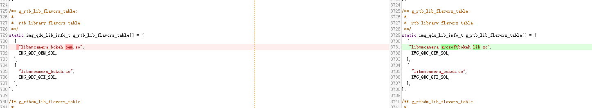
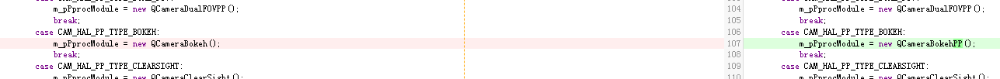

# 
Qualcomm Dual camera bring up

-----------------------------------------------------------------------------------
 

## 1.1 预备
### 1.1.1 确认双摄架构：
项目开始前，需要咨询高通所用芯片是否支持UDCF、UDCF-lite双摄框架。如果使用UDCF架构，则不需要修改camera apk代码，如果是UDCF-lite架构，则需要自己写camera apk。

### 1.1.1 确认双摄是否做硬件同步：
项目开始前，需要和客户确认双摄是否做硬件同步。如果需要，则需要和sensor vendor确认选型是否支持hw sync。且还要确认sensor在hw sync中是作master还是slave。

## 1.2 双摄bring up
### 1.2.1 双摄点亮流程：
1.点亮双摄时一般都是单独点亮主副摄，然后再去点亮双摄，此过程中关闭驱动中的hw sync setting。 
2.在dtsi中，一般qcom,camera@0, qcom,camera@1对应双摄节点。其它和弹舌没有差异。 
3.主副摄都单独点亮后，如果是UDCF架构，在终端输入如下指令： 

	adb root
	adb shell setprop persist.camera.expose.aux 1
	adb shell setprop persist.camera.hwsync.enable 1
	adb shell setprop persist.camera.pip.enable 1
	adb shell setprop persist.camera.preview.ubwc 0
	adb shell setprop persist.camera.rtb.bayer_mono 1
	adb shell setprop persist.camera.mctstuck.enable 1
	adb shell setprop persist.camera.hal.debug 5
	adb shell setprop persist.debug.sf.showfps 1
	adb shell setprop persist.camera.imglib.logs 5
	adb shell sync
	adb reboot

**key note**：输入指令后，骁龙相机就可以打开双摄。点击切换UI，当log中对应camera id 3时，为双摄。 

4.如果是UDCF-lite架构，则直接在双摄apk中打开双摄。由于sw sync是高通默认支持的，正常情况下此时就可以打开双摄。如果无法进入双摄，可以尝试一下步骤： 
（1）关闭hw sync，只让双摄跑sw sync，看看能否进入双摄。 
（2）检查2颗sensor驱动中的最大、最小帧率是否相同。双摄中2颗sensor的最大与最小帧率应该配置成一致。 
（3）检查sensor mode，确保都是default mode。 
（4）请camera tunning同事帮忙将2颗sensor的帧率固定在30帧，看是否可以进入双摄。 
（5）固定2颗sensor AE，看能否进入双摄。 

5.如果需要做hw sync，需要找sensor vendor要对应的hw sync setting，合入驱动中。 
6.使用示波器测量波形，验证hw sync是否ok。

### 1.2.2 双摄调试硬件同步：
硬件同步和sensor选型有关。不同的双摄选型，调试时遇到的情况也不一样。具体在《高通DualCamera硬件同步调试文档》中有总结，大家可以参考下。

### 1.2.3 双摄3A sync调试：
1.AE sync： 
在做双摄的OTP bringup时，需要做双摄AE信息的集成，将OTP中双摄的AE信息传给AP。 
AP使用OTP里烧录的数据来计算主从camera的感光度：

再算出两个camera感光度的比例关系，在计算gain的时候会加入计算！ 
Aec_port.c中下面这个函数里会打出主从camera的曝光和gain；

	aec_port_interpolate_aec_update_from_peer
	01-05 06:34:41.100   875 21495 I mm-camera: <STATS_AEC >< INFO> 6640: aec_port_interpolate_aec_update_from_peer: AECDualInterpolation: frame_id: 4, slave [role-3], multiplier: 0.7805
	01-05 06:34:41.100   875 21495 I mm-camera: <STATS_AEC >< INFO> 6648: aec_port_interpolate_aec_update_from_peer: AECDualInterpolation: Master exp_time: 0.0300, SG:RG:LC=(6.0378 : 6.2189 : 2804), exp_index: 283, lux_idx: 286.0487
	01-05 06:34:41.100   875 21495 I mm-camera: <STATS_AEC >< INFO> 6655: aec_port_interpolate_aec_update_from_peer: AECDualInterpolation: Slave  exp_time: 0.0300, SG:RG:LC=(4.7123 : 4.8537 : 1770), exp_index: 305, lux_idx: 308.0487
	01-05 06:34:41.100   875 21495 D mm-camera: <STATS_AEC ><  LOW> 5363: aec_port_event: AEC_EVENT: MCT_EVENT_MODULE_STATS_AEC_UPDATE Dir 0

2.AF sync： 
待完善！

 

3.AWB sync： 
在做bokeh时，高通不做AWB sync。 

### 1.2.3 双摄算法集成：
目前我们用的主要是虹软背景虚化算法，虹软背景虚化算法主要分两块： 
1.RTB（real time bokeh） 
高通有接口直接替换so就好了。

2.Snapshot： 
高通有框架，直接替换成arcsoft的对象就好了。

调试主要需要我们保证输入图的质量，我们可以开启一下属性dump出输入输出图，来确认哪个环节出了问题！
